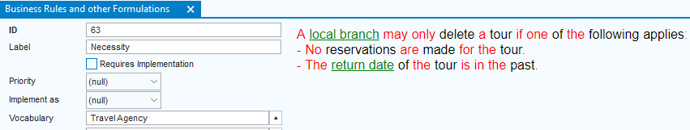
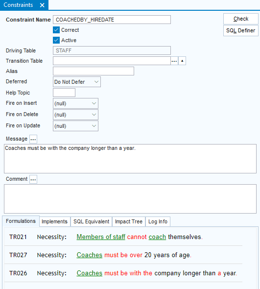

# Formulations in USoft Definer

`USoft 11``{.vs_11}`

A **formulation** in USoft is a carefully worded statement that expresses in natural language (English or Dutch) some term or definition or business rule that helps to clarify how a business is conducted:


Formulations talk about the business of the organisation that the development team is creating a USoft application for. They express what the team understands or assumes about their client.

As the example shows, formulations are colour-coded in a characteristic way. They take part of their meaning from surrounding terms, definitions and rules that you can find by clicking on some words coloured in green or blue.

The purpose of the [USoft Studio](/docs/Business%20rules/USoft%20Studio/USoft%20Studio%20quick%20tour.md) tool is to create and refine formulations. In USoft 11, you can increasingly use this technique in USoft Definer.

## Viewing formulations in the USoft Definer tool

### Business Rules window

Formulations appear in the "Business Rules and other Formulations” window that you can open from the Definer main menu via Teamwork, Definition, or from the Definer catalog.

This window is single-record, so 1 formulation appears at any one time:



A formulation in the Business Rules window### Implementations windows

Formulations appear on "Formulations” tabs in windows showing implementations, for example in the Constraints window. A "Formulations” tab works in tandem with the "Implements” tab right next to it. The formulations shown correspond to what you select in the "Implements” tab. As long as you do not populate the “Implements” tab, nothing will show in the “Formulations” tab.

For more on populating the "Implements” tabs, go to [Implementation registration](/docs/Collaboration/Between%20business%20rules%20and%20implementations/Implementation%20registration.md).

These tabs are multi-record, so it is possible for more than 1 formulation to appear at a time:



"Formulations” and "Implements”  tabs in the Constraints window## Navigating formulations in the USoft Definer tool

Wherever you are viewing a colour-coded formulation in USoft Definer, you can click the green and blue coloured hyperlinks. A browser pane opens that leads you to the USoft Studio source where the formulations were created. This way, the rich navigation and editing possibilities of USoft Studio become available at the click of a button. If you find you have to edit a formulation or a cluster of formulations, after the edits, you can easily synchronise USoft Definer by re-importing the edited material from USoft Studio.

## Creating formulations in the USoft Definer tool

Here is the preferred way of creating navigable formulations in USoft 11.

1. Make sure you do not have remaining formulations or business rules in USoft Definer from earlier development work. You can preserve your earlier Business Rules by storing them in a backup vocabulary with a different name than the USoft Studio vocabulary you are going to use to import new formulations. See the next section of this article.
2. In USoft Studio, prepare the first version of the formulations you want to see in USoft Definer.
3. Import the formulations from USoft Studio by using the Studio-Definer bridge.

USoft recommends you use a single USoft Studio vocabulary in any one instance of USoft Definer 11. Edit the formulations in USoft Studio and re-import them into USoft Definer as often as necessary to keep the 2 tools conveniently in sync.

> [!TIP]
> To view or change the URL by which USoft makes the formulations navigable, choose Teamwork, Preparation, Vocabularies. See that the Studio-Definer bridge has created a Vocabulary record for your import. This Vocabulary contains a URL that is used each time a developer clicks on a coloured hyperlink in an imported formulation.

## Preserving earlier Business Rules in a backup vocabulary

This article has explained a way of working where Business Rules and other formulations originate in USoft Studio and are carried over to USoft Definer.

In previous versions of USoft, Business Rules were created and edited directly in the USoft Definer windows but they did not  have the rich USoft Studio editor and viewer possibilities.

These possibilities will gradually be introduced in the USoft Definer tool so that the 2 tools become completely merged.

In the meantime, you may have existing Business Rules that you created in USoft Definer away from the USoft Studio tool and that do not look good in colour-coding but that you still want to preserve. You can place this material in a backup vocabulary so that, in parallel, you can use a differently-named vocabulary for trying out the new interaction with the USoft Studio tool described above.

### Placing existing old-style Business Rules in a backup vocabulary

To place existing old-style Business Rules in a  backup vocabulary:

1. Choose Teamwork, Preparation, Vocabularies from the USoft Definer main menu.
2. Create a record for the backup vocabulary. All you need in this record is the name and language of the vocabulary. Set (for example) Vocabulary = Backup. Set Language = en-GB if your material is in English or Language = nl-NL if your material is in Dutch. Leave other fields empty. Save work.
3. Place your existing Business Rules in this vocabulary by executing this SQL statement:

```sql
UPDATE   t_business_rule
SET      vocabulary = 'Backup'
```

### Viewing old-style Business Rules in a USoft 10 window

You can view, query and edit old-style business rules in a USoft 10 window:

1. Choose Teamwork, Definition, USoft 10: Business Rules and Processes from the USoft Definer main menu.

## Migrating earlier Business Rules to USoft Studio

USoft supplies a utility for one-time migration of existing Business Rules to a USoft Studio location. This allows you to apply the new features around Formulations to your existing Business Rules material.

To migrate earlier Business Rules to USoft Studio:

1. Make sure that you have a USoft Studio location that you have access to as an Owner.
2. Create a new empty project where you can migrate the Business Rules coming from USoft Definer. You can also clear an existing project by pressing the Reset button.
3. Set the empty project to the language of the material you want to migrate: en-GB for English, nl-NL for Dutch.
4. In USoft Definer, perform the following export:

```sql
INVOKE   xml.export with
SELECT   *
,        'c:\*working-dir*\source.xml' WriteOutputTo
FROM     t_business_rule
```

5. Apply the following XSLT transformation supplied by USoft in the \\xsl\\Util folder of your USoft installation directory:

```sql
INVOKE    usxsl.apply2file with
SELECT    'c:\*working-dir*\source.xml'
,         'c:\*USoft-install-dir*\xsl\Util\DefinerToStudio.xsl'
,         'c:\*working-dir*\target.xml'
,         'string:lng_code'
,         '*lng_code*'
```

where *lng_code* must be set to en-GB if your material is English, and to nl-NL if your material is Dutch.

6. In USoft Studio, on the Administration page, for the empty project, press the Import File button and point at the "target.xml” file produced in Step 5.