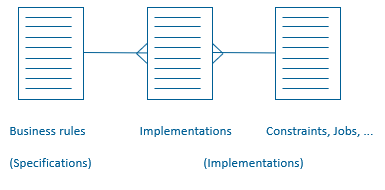

# Implementation registration

In USoft, as a development team, you can optionally register that some specification (typically, a business rule) has been implemented in some way.

In the USoft Definer metamodel, this link between specifications and implementations is an *intersection table*: a table that is a child of both the business rule and the object or objects (constraint, job...) that implement the rule:

This is a flexible structure because:

- You are free to introduces rules and implementations in any order, and to link them up or not.
- You can link a rule to *multiple* implementations (for example, a Column and 2 Constraints) if you like.
- You can link an implementation to *multiple* rules or other formulations if you like.
- Dropping a rule or implementation will automatically cause any corresponding links to be dropped. The only exception is that, as a security measure, you cannot drop rules without first dropping  corresponding implementations.

`USoft 11``{.vs_11}`

## "Implemented By”: How to register what a rule or other formulation is implemented by

To register the implementation of a rule or other formulation:

1. In the USoft Definer menu, choose Teamwork, Definition, Business Rules or other Formulations.
2. Retrieve the rule or other formulation that you want to register one or more implementations for.
3. Click the "” tab near the bottom of the window.
4. Click in the Type column of the grid. A dropdown list appears showing possible implementation types. Choose an implementation type.
5. Click in the “Name 1” column. Press F12 (Lookup). Select an implementation.

## "Implements”: How to register for an implementation what rule or other formulation it implements

To register, for an implementation (for example, a Constraint) what rule or other formulation it implements:

1. Open the window where you defined the implementation.  For example, for a  Constraint, open the Constraints window.
2. Retrieve the implemention in this window.
3. Click the "” tab near the button of the window.
4. Click in a record line in the grid. Press F12 (Lookup). Select a rule or other formulation.

 