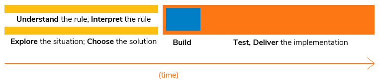

# Implementing a rule: the process

As a developer, in a low-code platform such as USoft, you do not spend most of your time actually *building* an implementation.

More importantly, you spend time *before* to really understand (interpret) the business rule, explore the surrounding situation, and choose the implemention. Also, you spend time *after* to test and deliver the implementation as soon as you have built a first version of it. This can be visualised like this:

[Understanding and interpreting business rules](/docs/Collaboration/Between_business_rules_and_implementations/Interpreting_a_business_rule_example.md) is a special skill that USoft developers have over other developers and programmers.

## Your task preceding the implementation

Before you actually build an implementation, you spend time understanding and exploring. You may be in a greenfields situation, but you are much more likely to be in an application where many business rules and many implementations already exist. If that is the case, it is essential that you **find** all the related business rules and implementations so that you can make a better assessment both of what the rule really means and how it is best implemented.

In the Collaboration tutorials, you learn to use the different tools and features of the USoft platform that allow you to do just this. Here is a summary.

- In USoft Studio, you can find rules by concept.

- In USoft Studio, you can find rules by browsing SBVR concept diagrams and BPMN process flow diagrams.
- In USoft Studio, you can find implementations by browsing E/R data model diagrams.
- In USoft Definer, you can find implementations by name (Edit, Find In Repository), and by the impact they have on each other (View, SQL Objects; Impact Tree feature for Constraints).
- In USoft Definer, you can query implementations by construct.
- In both USoft Studio and USoft Teamwork (a part of USoft Definer), you can find specifications and implementations by various subject area dividers (Business Areas, Business Objects, Rule Sets). See the "Subject area dividers" article in this Knowledge Base section.
- In USoft Teamwork, if your team puts in the effort to relate specifications to implementations using the Implementations feature, you can find specifications by implementation, and implementations by specification. See the "Implementations" article in this Knowledge Base section.

## Your task following the implementation

In USoft, the most important **tests** occur immediately after you build. This is because USoft gives you the opportunity to run your rule immediately against realistic, 'live' application data in a working application with an instantly generated GUI. In fact, important tests could occur even *before* you build the final solution, as when prototyping gives you the insight that you need a different implementation after all.

Also, in USoft, you address **delivery** to a Production environment while you build. The clearest example of this is that you can detect at an early stage that existing application data require adaptation because of the change you introduce. You can test and register the data operations that must occur later in Production in USoft Delivery Manager at build time.

 