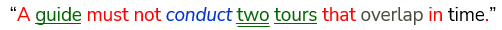
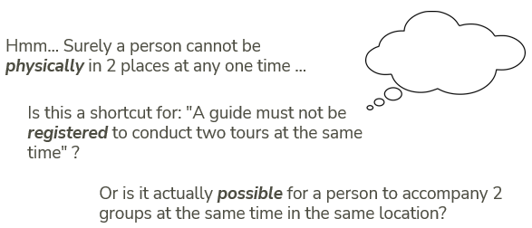
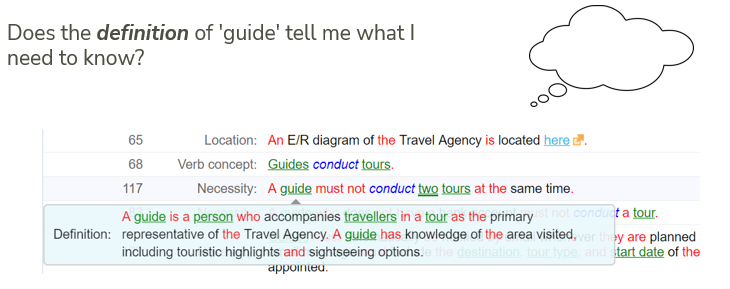
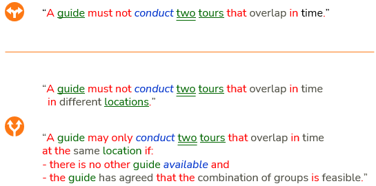

# Interpreting a business rule: example

A business rule is short and easy-to-read. But as a USoft developer, to find out how to implement it, you need to spend time *interpreting the rule*. Look at the rule from all sides. Also *look around* in Studio for additional cues to meaning and intent, and *look around* in the USoft implementations to see what is already there and how your implementation work will fit in.

Then, build a prototype implementation in a short time, preferably using USoft's low-code features. Present the prototype for early validation as soon as you can.

Here is an example of a rule and the interpretation work that it can give rise to. The rule comes from a tour operator:



The first thing that the USoft methodology invites you to do is to take the rule logic at face value. If you do that, you can simply translate it into a data structure and a constraint that enforces the rule as stated. Essentially, you can cover this rule by a single constraint, and you're done:

```sql
SELECT         ''
FROM           tour t1
,              tour t2
WHERE          t2.tour_id != t1.tour_id
AND            t2.guide    = t1.guide
AND            t2.start_date BETWEEN t1.start_date AND t1.return_date

```

The beauty of USoft is that you can create at minimal cost a rules-governed database that supports business reality by *reflecting in data* what must be the case in that business reality.

This is certainly a valid path to consider. However, you need to take some time to make sure that you are not misinterpreting the situation. Is there any room for misinterpretation left?

Turn this around in your head:



 

Browse around in USoft Studio for additional cues:



You are told that a guide actually *accompanies* the travellers on location. The only way that a guide can do that for 2 tours at the same time is if the tour operator sometimes combines tours, so that travellers from different tours spend their holiday in the same location at the same time. This scenario is plausible enough that you need to go back and validate with the client if this scenario has not been overlooked by accident.

First, imagine that it has not been overlooked. The client's answer is that groups of travellers almost never spend the same time in the same place, and even if they do, a guide is never asked to take responsibility for multiple groups. In this situation, the rule is clearly not about business reality (guides cannot physically do different groups at the same time), so the intent of the rule is that the *database software* (the USoft application) that you are implementing must reflect this restriction to avoid registration errors: double-booking of guides at planning time. Now, a case could be made for rephrasing the rule, so that it talks explicitly about software and no longer about business reality:

"In the USoft application, it must be impossible to register the same guide as being booked on two tours that overlap in time”.

but the idea of USoft’s low-code approach is that you do not constantly need to write about the target software in separate words than you write about the business reality it must support. It is easier, faster and more maintainable to connect working software directly to validated business rules.

Because of this general idea, in this situation, you can simply add the constraint that we showed earlier, and then connect it to the rule by registering it as being the rule's *implementation*. This gives you highly maintainable software at low cost.

Now imagine a different situation. The dialogue with your client reveals that it is undesirable, but not impossible, that a guide takes responsibility for multiple groups in the same location at the same time. It could be undesirable because this is more difficult for guides to do well, or because it entitles them to extra pay. This discovery would lead to rule *refinement.* In this particular case, it could mean that the rule above the orange line is replaced by the 2 rules below the orange line:

 



 

Here, the top rule below the line clearly states a situation that is actually physically impossible for a guide to achieve, so the intent of this rule can only be a restriction in the supporting software application. Again, for the reason discussed before, you do not need to rephrase the rule just so that it explicitly talks about the target software behaviour, as opposed to the impossibility in business reality that the software must be aware of. It's better to keep it simple.

The rule at the bottom can be implemented or supported in many different ways, but as before, the USoft methodology suggests a low-code *first choice* that is easy to build and maintain. You can quickly build this and show it as a prototype. This way, you will quickly find out if the implementation must change, or if the rules must be refined further, or both.

This *first choice* is to create a small number of constraints that together implement a subsystem. You need to add some sort of flag (probably a Yes/No flag with a prompt such as Shared Guide). Then, you need to add some sort of flag (probably another Yes/No flag, with a prompt such as Guide In Agreement). The first flag is set by constraints and the second flag is set by guides. The second flag is relevant only if the first is set. Finally, at UI level, you need to create some sort of screen or option whereby guides are invited to agree (or not) with guiding multiple tours simultaneously.

This article has shown how a business rule is a starting point for careful consideration of what is actually intended or needed in the way of implementations. But it has also shown that USoft usually suggests a *first choice* and that, in order to benefit from low-code features in USoft, you should not complicate matters more than strictly necessary.