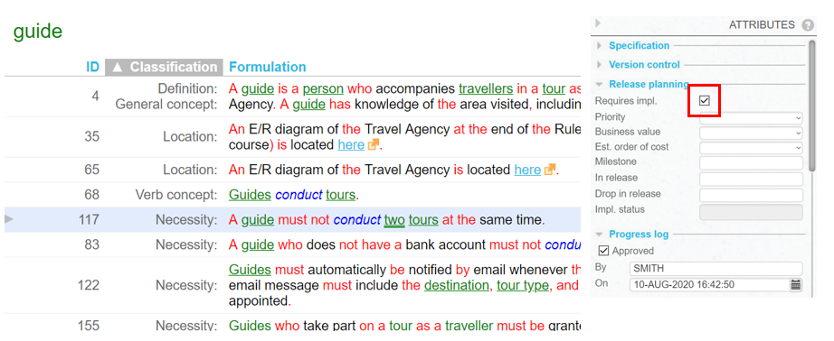

# Some business rules require implementation

The USoft Studio tool supports the idea that some business rules require implementation, and others don't.

You can register *any* business rule that you discover in USoft Studio.

You can subsequently flag the business rules that you decide should have an impact on your development work.

In the example, it has been decided (= registered) that rule no. 117 requires implementation in :

**A business rule may or may not require implementation in software**

 