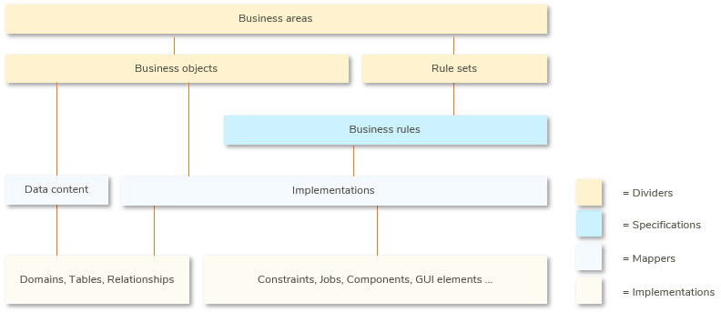
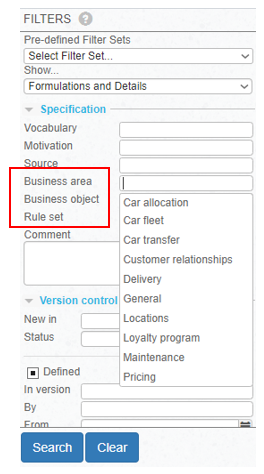
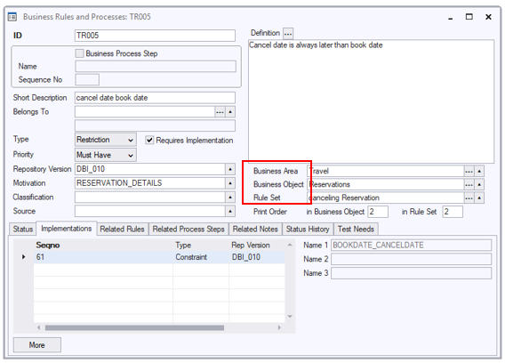
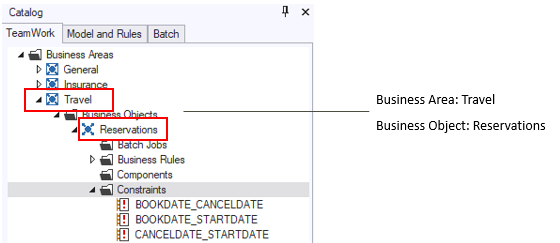
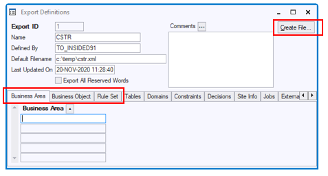

# Subject area dividers: Business areas, business objects, rule sets

In USoft, as a development team, you can optionally classify both specifications (such as business rules) and implementations by **business area**, by **business object**, and by **rule set**.

A business area can be any functional (rather than technical) subdivision that is meaningful in a large project. What is a good basis for subdivision in business areas depends on the individual project. This subdivision may need to be revised or refined regularly. Examples of business areas could include such activitities as Sales, Marketing and PR. But these examples could just as well prove completely unpractical in your specific project.

A business object is a smaller subject area. In USoft Teamwork (a part of USoft Definer), you can organise a business object in such a way that it belongs to a (larger) business area, and also in such a way that it is tied to a specific data structure: a subset of the domains, tables and relationships found in your data model.

A rule set is an area of functionality where a collection of rules works together to achieve something: a mechanism. This could be a price calculation mechanism, or a select-and-match mechanism between clients and products. A rule set may or may not be expressed in a decision table. In USoft Teamwork, you can organise a rule set in such a way that it belongs to (operates within) a business area.

## Filter, query and search features based on subject area dividers

If you use subject area dividers, this gives you added filter, query and search capability. In USoft Studio, you can search specifications by filtering by subject divider in the FILTERS pane on the left (select a value in the field, then press the Search button):

Subject area dividers give you similar query possibilities in many places in USoft Definer, for example, in the Business Rules window in USoft Teamwork:

## Catalog navigation based on subject area dividers

In addition, items classified by subject area dividers appear classified by them in the Teamwork catalog, from which you can then access both the dividers and the items divided by them by double-click or right-mouse-click:

 

## Object shopping facilities created by subject area dividers

If you use subject area dividers, in Teamwork, Object Shopping, you can easily define "baskets" of objects that you have classified as belonging to the subject area divider. This makes it easy to export collections of related objects to a file and bring them to a different repository:

 