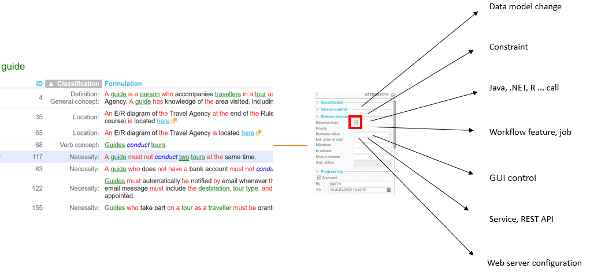
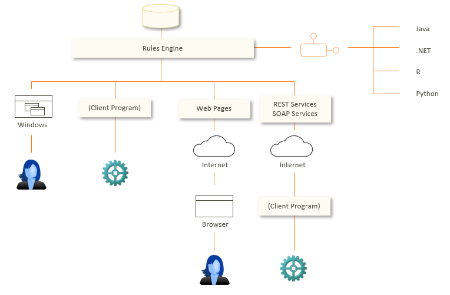

# What implementation for your business rule?

Once you have decided that your business rule needs an implementation, the next step is to decide what type of implementation that should be. Choosing the best implementation for a rule is a primary skill of trained USoft developers. A business rule may be implemented in USoft in many different ways:

 

Your choice depends on many factors. Some of these are directly related to the individual business rule. Does the rule translate easily into a form of data integrity? If so, do you want to implement it restrictively (giving an error message if the rule is violated) or productively (making adjustments under the hood so that the rule is met)? Is organising data integrity *enough,* or does the rule make it necessary to (also) have a certain level of user-friendliness in human interfaces (GUIs) or software interfaces (APIs) or both? If the rule involves building new resources, who is allowed to access those new resources?

Other factors have to do with functional characteristics of your application as a whole, and especially, the ways in which it may connect to other software and other data sources. If your rule causes you to change or enrich application data, what does that mean for consumers of that data and for data reporting features? Application style is also a consideration. If your application has a restrictive style with excellent error messaging, you are more likely to continue in this line by adding a new restrictive implementation.

Finally, technical factors also influence your choice of implementation. They have to do with the physical software environment: the specific USoft technology stack that you are building. All USoft technology stacks are characterised by a Rules Engine acting as a protective layer around structured data, but other aspects vary widely, for example, the type of external components you are in the habit of calling, and the type of service-oriented infrastructure you may or may not have. Your new implementation needs to adapt to these parameters.

 