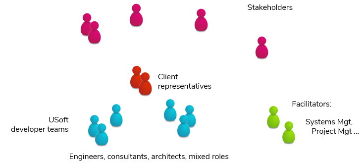
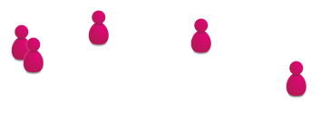

# Collaboration in a USoft project

USoft is an environment for building business software quickly and reliably in small chunks. The USoft principles that shape collaboration in a USoft project are:

- Small, horizontal development teams.

- Rapid development and prototyping. Short feedback cycles that involve all stakeholders.
- Communication primarily on the basis of business rules formulated in natural language.

USoft collaboration principles are defined in general terms only, so that they capture the reality of a wide variety of projects where the USoft offering adds value. They are backed at a technical level by:

- USoft low-code tools for creating different types of software implementation with a minimum of manual programming effort.

They are backed at a functional level by:

- USoft software features that facilitate rules-based communication and specification, project organisation, and communication among development team members. These software features are mainly subsumed under the "USoft Teamwork" header.
- USoft Approach, a description of good practice based on the detailing of project phases.
- Best-practice insights from both early Agile methodologies such as I-RAD and DSDM, as well as later Agile methodologies such as Scrum.
- The body of knowledge that allows **business rules** to be understood as a key concept in both business modelling and software requirements specification. One version of this body of knowledge has been formalised by the Object Management Group (OMG) as the Semantics of Business Vocabulary and Rules (SBVR).
- A school of thought that could be summarised as *fact-based modelling*, as opposed most conspicuously to *object-oriented modelling **. Fact-based modelling initiatives include Conceptual Modeling based on entities, relationships, attributes and constraints (conceptualmodeling.org); Object-Role Modelling (ORM) (orm.net); and, in the Netherlands, on the one hand, the different tenets and descendants of Natural-Language Information Analysis Method (NIAM), such as Fully Communication-Oriented Information Modelling (FCO-IM) and cogNIAM (www.pna-group.com), and on the other hand, the transaction-based work of J. Dietz at TU Delft in Entity Ontology (Enterprise Engineering, www.demo.nl).

* Object-oriented artefacts can still be integrated in a USoft project with ease, because the USoft platform offers call interfaces to object-oriented components at rule level, a concept named Rules-Driven Method Invocation (RDMI).

## Who is involved?

The primary stakeholders in a USoft project are the **business stakeholders**. They are the people for whom the software is being built. The primary actors in a USoft project are the members of the **developer team** (or teams). They are the people building the software.

Any sizeable USoft project has one or more **client representatives.** They are the person, or persons, whose primary responsability it is to make sure that business stakeholders and development team communicate properly and as frequently as is necessary.

**Facilitators** make sure (at a technical level) that the development team has working computers, connections, and communication software, and (at an organisational level) do planning work, oversee software delivery, and arrange different types of meeting.

## Business stakeholders

**Business stakeholders** include people who have managerial and organisational roles. They are project owners responsible for the budget and financial planning of a project and for the overall quality and vision of the end product. They typically include only people who work directly for the client, or people hired to act on behalf of the client. While the USoft product and methodology cover collaboration with these stakeholders at the level of what the project is *about* (both specifications and implementations), it does not cover general project management, financial planning and financial reporting.

Business stakeholders also include people who are knowledgeable in the subject field that the project is *about.* In a greenfields project, these are domain experts in a general sense. In a conversion project where legacy software is being replaced by USoft solutions, they may also include specialists and end users of the existing software. In a project that involves making changes to a full-fledged, already existing USoft project, they may include specialists and end users of the USoft application used in production.

## Developer team members

**Developer team members** include a wide variety of professionals: engineers and programmers; consultants, architects and business analysts; testers and documentation specialists; and people in mixed roles. USoft aims at *horizontal teams* where members can step in and help each other out as much as possible, while each team member also has his specialisations and strong points. Teams are typically *small:* 2-5 members. USoft has software tooling that makes it easier to split large projects into multiple sub-projects, each with its own small team. This tooling includes features for Modular Development; Repository Management, Object Shopping, and Delivery Management.

## Client representatives

**Client representatives** include people who work directly for the client as well as third-party professionals such as external project managers, but they could also include people working on behalf of USoft and made responsible for ensuring that the end result meets client expectations and requirements. Thus, who is client representative depends on the form of co-creation chosen. At one end of this spectrum, USoft develops software *for* a client or even re-sells existing software that is only *customised* (configured) for a client. At the other end of this spectrum, USoft is mobilised as a toolset rather than a consultancy organisation; here, the client itself or people hired by the client are responsible, and people external to USoft are trained to work successfully in a USoft environment.

The primary concern of client representatives is (at both functional and technical levels) to make sure that the end result matches client requirements and expectations. Client representatives must avoid any form of misunderstanding.

In Scrum, Product Owners are an example of client representatives.

Project managers are in an in-between category. They could be a "client representative" or a "facilitator". Project managers typically do not know the details of what the project is *about.* The client may delegate or hire project managers to make sure that the work is done within time and budget, or that the project proceedings (as opposed to the end product) meet a certain stated level, or both. In cases like this it may be helpful to categorise project managers as a type of "client representative". In smaller projects, project management may be in the hands of the development team itself.

## Facilitators

**Facilitators** include administrators and system managers responsible for software infrastructure, availability, performance and security. They facilitate not just the running and maintenance of USoft applications in Production, but also the infrastructure for the development team.

Facilitators also include administrative people specialised in planning meetings, communicating with stakeholders, and ensuring the correct and agreed use of communication software.

In Scrum, Scrum Masters are an example of facilitators.