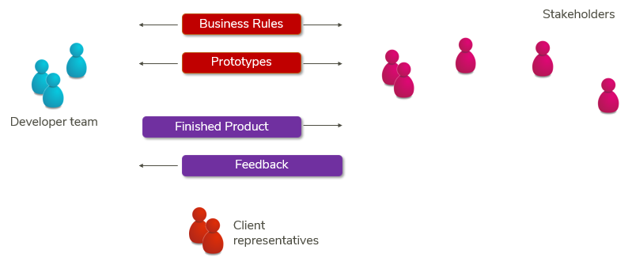

# How a USoft team communicates with stakeholders

A USoft team typically communicates with stakeholders (*a*) through **business rules** and (*b*) with the help of **software prototypes**.

By default, business rules come in the form of language statements ("sentences"). It is often possible and preferable to present them in a different form, for example, process flow diagrams or decision tables. Business rules are ideal for communicating facts not about the target software itself but rather about the context in which the software is to function. Business rules are also appropriate for formulating any aspect of the software or its surroundings that does not have an immediate visual aspect in the sense of an actually visible element in a software screen, for example, financial calculation rules.

In a low-code environment such as USoft, software prototypes are typically easy to make and change. They are ideal for making business stakeholders respond to work in progress, especially to aspects that can be make immediately visible or tangible. Thus, a push button can represent a task that can be started in some situation. A sequence of screens can visualise a workflow. Of course, another advantage of prototypes is that they immediately present graphic design and interaction design in GUIs.

In cycles, the development team gradually delivers versions of the finished product. Each cycle gives stakeholders the opportunity to communicate feedback for the next cycle.

 

 