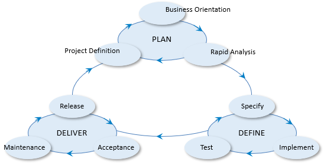

# USoft Approach: a global skeleton for project phasing

[USoft Approach](/Collaboration/USoft_Approach) is a description of best-practice in terms of project phases. It offers different levels of detail. At the highest level, it offers a vision of how USoft projects are best carried out in phases.

The arrows in the picture show that USoft Approach is *cyclic.* The three basis phases of PLAN, DEFINE and DELIVER are repeated.

 

 