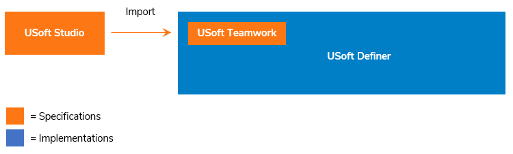

# USoft Teamwork

USoft Teamwork is the part of the USoft Definer tool that holds specifications.

The rest of USoft Definer does not deal with specifications but with implementations. The primary purpose of USoft Definer is to create implementations: working USoft software solutions. You create implementations by defining objects, such as Domains, Tables, Constraints, RDMI Components, and Jobs. The objects are stored in a structure of related repository tables. By defining the object, you create the software.

USoft Teamwork is the (comparatively small) part of USoft Definer that holds not working software but, instead, **specifications**: descriptions of what the software does, or what it must conform to. These specifications are stored in a special subset of the repository tables.

USoft Teamwork is the older version of USoft Studio. USoft Studio is richer: unlike Teamwork, it offers a browser-based interface, a natural-language parser, text colour-coding and hyperlinking, diagramming, and version control. Studio is a SaaS-delivered solution while Teamwork is an integral part of the USoft platform. Studio-only clients never need to install the USoft platform. USoft platform clients who, for some reason, do not wish to use Studio can use Teamwork instead. Because Teamwork is optional, they can also choose to do their specifications away from USoft altogether.

USoft is planning to migrate Studio so that it becomes an integral part of the USoft platform. As and when that happens, Teamwork will be replaced by the new-style Studio.

If you use both Studio and Teamwork, you can choose to have specifications transferred automatically by the Import feature. Why would you do that?

- Teamwork has the same dividers (Business Area, Business Object, Rule Set) as Studio. In USoft Definer, the **Teamwork Catalog** on the left will show listings of things like Business Rules by these dividers. It also offers access points to these items.
- Teamwork offers the possibility to **relate implementations** to specifications. In the Implementations table you can indicate, for example, which Constraints contribute to the implementation of a given Business Rule. This way, these connections are made traceable and navigable.
- Teamwork offers **export definitions** and Object Shopping. Using these features, you can easily export, for example, all the Business Rules and related implementations that belong to a given Business Area, perhaps for testing this subset in a separate environment.

 