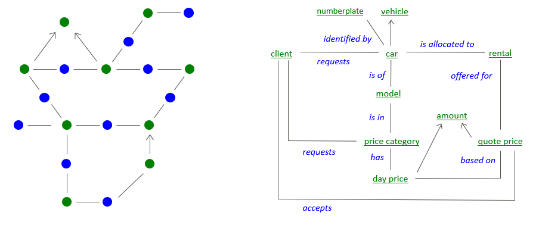
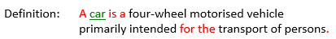
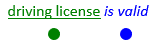
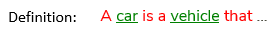
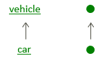

# Concept structure

If you have a collection of interrelated business rules, you can think of them as being underpinned by an underlying network of verb concepts and noun concepts. If you represent a verb concept by a blue dot and a noun concept by a green dot, you can think about this network as looking something like this (visualisation of the idea on the left; example concepts on the right):

## Noun concepts

Noun concepts appear in USoft Studio when a definition such as the following has been introduced (here, the noun concept is car):

and also if a declaration such as the following has been introduced, which establishes car as a business term but without giving a definition:

## Verb concepts

Verb concepts appear in USoft Studio because a declaration such as the following has been introduced:

This is an example of a verb concept that links 2 noun concepts (*binary verb concept*):

A verb concept can also be introduced by a declaration such as:

in which case it involves only 1 noun concept (*unary verb concept*):

## Categories

A definition such as the following establishes a noun concept as a special case or *category* of another noun concept:

'Car' is a category of 'vehicle' because a car shares all the characteristics of vehicles but also has characteristics of its own that set it apart from other vehicles. This is represented by an arrow pointing away from the category toward the more general concept:

 

 

 