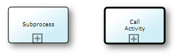

# Navigating BPMN diagrams

There are different ways to navigate from one BPMN diagram to another.

## Inter-diagram navigation

First of all, BPMN diagrams in USoft benefit from general navigation features of USoft Studio. These allow you to "jump" to a related diagram via the sidepane with related concepts.

To use this:

1. In the first diagram, click on a subject that you suspect is in the "overlap", that is to say, exists also in a second BPMN diagram you might want to go to.

2. In the sidepane on the right, find the formulation ("... is located here .") that represents that second diagram. The sidepane shows formulations for all diagrams where the clicked concept appears.

3. Click on the " here " link in that formulation.

The diagram you were looking at is now replaced by the second diagram.

## Subprocesses and call activities

BPMN makes a difference between *subprocesses* and *call activities.* They both appear as activity boxes with a square containing a plus ('+') symbol, but call activities have a thicker border:

## Subprocess navigation

BPMN offers a way to collapse large diagrams by moving the detail of subprocesses to separate subprocess diagrams.

The '+' symbol in the 'Allocate car' activity box indicates that details about this activity are not shown but instead, are in a separate diagram. If you click the '+' symbol, you navigate to that separate diagram:

The diagram you navigate to, looks like this:

The two elements highlighted by red boxes help you in this navigation. The diagram name in the header bar is still the name of the main process that you "came from": this stresses that you are viewing not another main process, but the details of a particular area of the first main process. The "breadcrumbs" control in the top left corner visualises the path that brought you to where you are. If this subprocess has its own subprocesses (not in the picture), you could go there and the breadcrumb control would show 3 steps instead of 2. You can click on the first step of the breadcrumb control to navigate back to the main process.

The subprocess diagram has 2 possible outcomes, that match the question asked in the main process after the subprocess has occurred. The subprocess does not have a swimlane: because of its position in the main process, it is understood to be in the swimlane for delivery desk.

A subprocess can have its own subprocesses, but any subprocess (at any level of depth) is considered an integral part of the top-level main process. You can only access the details of a subprocess by first opening that top-level main process and then "drilling down".

In USoft Studio, there is 1 formulation that represents the main process including all its subprocesses. This formulation has a "here" hyperlink that lets you access the diagram(s). There are NO separate formulations for the subprocesses.

## Call activity navigation

A **call activity** is a standard routine available to multiple other processes. For example, a car rental company could perform credit checks to find out the financial solvability of a client. This could involve contacting a bank or credit bureau. This same routine could be required at different points in different "calling" processes (long-term car rental, car lease, second-hand sales...)

A call activity is a stand-alone process in its own right. It can be (re-)used in other processes, but it is not an integral part of those processes.

In the same way as with subprocesses, at the point where the call activity is used, you can click the '+' symbol to navigate to the call activity diagram.

In USoft Studio, there is a separate formulation that represents the call activity. This formulation has a "here" hyperlink that lets you access the call activity directly. In addition, each of the processes that call the call activity also have their separate formulations.

## Subprocesses and call activities compared

|**Subprocess**|**Call activity**|
|--------|--------|
|Integral part of a single larger process.|Stand-alone process available to multiple other processes.|
|Appearance: Activity box with a thin border contains a square with a '+' symbol.|Appearance: Activity box with a thick border contains a square with a '+' symbol.|
|Two-way navigation: click '+' to drill down or "zoom in", click step symbol in breadcrumb control to "zoom out".|One-way navigation: click '+' to leave the current process and go to the called activity.|
|USoft Studio formulation for the top-level main process only.|USoft Studio formulations for each call activity and also for each process calling it.|
|Structure: Hierarchical tree structure of embedded subprocesses below a top-level main process|Structure: Network of references (or: links) from calling processes to call activities|

 

 

 