# SBVR concept diagrams

This article is for developers responsible for USoft implementations. It tells them how to interpret (= read) SBVR concept diagrams in USoft Studio so they understand better what is expected of them.

If you want to *create* SBVR concept diagrams, please go to the Home page of USoft Studio. On the Help tile, on the Diagrams tab, open the PDF document about SBVR diagrams.

## What is an SBVR concept diagram?

USoft uses the practical terms of "SBVR diagram" or "SBVR concept diagram" informally, but they could lead to confusion. The formal specification "Semantics of Business Vocabulary and Rules" (SBVR) published by the Object Management Group (OMG) is not normative about any form of diagramming. It does use a subset of UML diagramming techniques informally in order to visualise concept structure, and thus support better understanding of the specification. This type of diagram is what may be created in USoft Studio as an "SBVR diagram".

Here is a small example of an SBVR concept diagram:

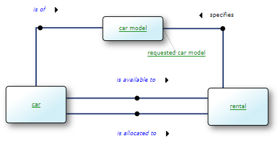

As you can see, an SBVR concept diagram is characterised by boxes connected by lines that have small black dots in their middle. Each diagram in USoft Studio is mapped to a formulation. If your project has a SBVR diagram, you can find it by finding the formulation that represents it, and then clicking on the "here" link in that formulation. Formulations representing SBVR diagrams often actually *talk* about SBVR diagrams, in which case you can easily find them by searching for the letters 'sbvr':

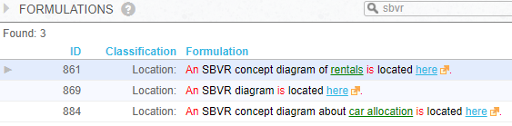

> [!CAUTION]
> It is possible that these formulations do not use the letters 'sbvr' but only, for example, the word 'diagram', or only words describing what the diagram is about. The ending "... is located here" is necessary for a formulation to represent a diagram.

## What is an SBVR concept diagram *for* ?

An SBVR diagram is ideal for visualising how noun concepts ("green" concepts) and verb concepts ("blue" concepts) are interrelated, what different relationships exist between them.

A diagram in USoft Studio is not just a drawing. It offers rich additional practical functionality:

- You can see a definition of a depicted concept by hovering it with the mouse.
- You can click on a "green" or "blue" concept to get, in a sidepane on the right, a structured list of all formulations that use the concept. All the business rules that use the clicked concept appear in the sidepane at this point. If you find one is missing, you can add it.
- In the sidepane, you can do further navigation, or change, drop or add formulations.
- Any text used in the diagram is *automatically* linked to concepts known in USoft Studio project. As a consequence, any text that is NOT green or blue in the diagram is guaranteed NOT to exist as a concept. The fact that "specifies" in the example diagram at the top of this article is black and not green, tells you that there currently exists no such concept as 'rental *specifies* car model'.

An SBVR diagram does not typically offer semantic information that is not already in the formulations themselves. It merely adds a visual depiction of concept structure.

## Binary verb concepts

Binary verb concepts, or binary fact types, are verb concepts ("blue concepts") that involve noun concepts ("green" concepts) in 2 places. Each noun concept involves plays a *role* in the verb concept. Binary verb concepts are depicted by a line connecting 2 boxes:

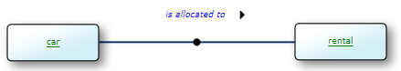

or, alternatively, by a diamond connecting to 2 boxes:

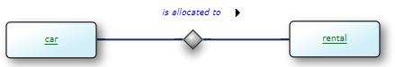

## Unary verb concepts

Unary verb concepts, or unary fact types, are verb concepts ("blue concepts") that involve a single noun concept (a "green" concept). The noun concept involved plays the *role* in the verb concept. Unary verb concepts are depicted by a box and a diamond connected by a line:

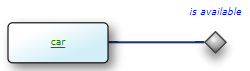

## N-ary verb concepts

N-ary verb concepts are verb concepts ("blue concepts") that involve noun concepts ("green" concepts) in more than 2 places. Each noun concept involves plays a *role* in the verb concept. N-ary verb concepts are depicted by a diamond and as many boxes as there are noun concepts involved. The diagram is connected to each of the boxes:

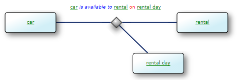

> [!NOTE]
> The USoft Studio language engines that process and colour-code formulations are not capable of recognising n-ary verb concepts in natural language. As a consequence, an n-ary verb concept is unlikely in USoft Studio to be colour-coded as intended. In SBVR documents, n-ary verb concepts are commonly colour-coded with an alternation of green and blue text, but no red or black text:
> car*is available to*rental*on*rental day

## Categories

A category is a noun concept that is a "special case": it shares all the characteristics of another noun concept, the *more general concept*, but it also has one or more characteristics that set it apart. A category is depicted by an arrow line pointing from the category to the more general concept:

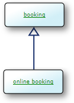

A category can have one or more categories of its own. This can result in entire tree structures of categories (not shown).

A concept can have 2 or any higher number of categories. If categories are mutually exclusive (a *segmentation*), they share the same arrowhead. The picture on the right is equivalent to the picture on the right except that it implies that a one-way rental is never also a car transfer:

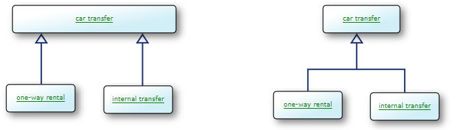

## Roles

A role is a point of involvement where a noun concept is involved in a verb concept. In a business domain, there is often a noun that names such a point of involvement, such as "employer" and "employee" in:

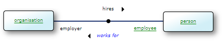

Role names may be placed close to the end of the line that connects the noun concept box to the black dot or the diamond representing the verb concept.

In SBVR, the roles are different concepts than the *general concepts* represented by the boxes. Business speakers, at least those using Western natural languages, typically don't take notice of the difference: they might just as easily speak of "employers hiring people" than of "organisations hiring people".

If a role name is very close to the line, it simply floats in space:

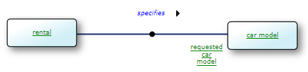

If it is further away, it is connected to the line end by a small dotted line:

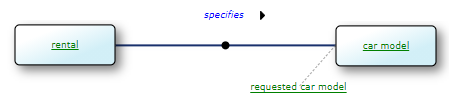

USoft allows also to represent a role as a box (below). This box can have further connections to other concepts.

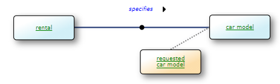

Here is an example of roles in an n-ary verb concept:

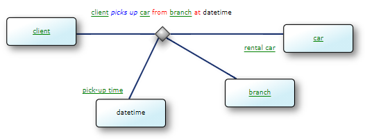

## Nominalisations

A nominalisation is a noun concept that summarises a verb concept. It serves as "umbrella term" for the verb concept. A nominalisation is depicted by a box connected by a dotted line to the diamond that represents the verb concept:

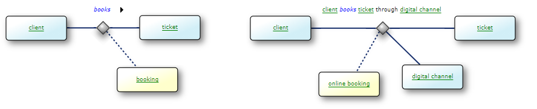

##  

 

##  

 