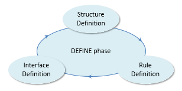
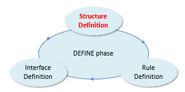
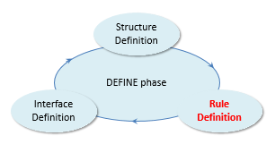
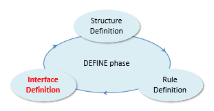

# The DEFINE phase

In the DEFINE phase, you actually create specifications and implementations.

The word DEFINE is perhaps unexpected for a work phase that may involve programming in Java, .NET or XSLT, executing SQL queries, writing help documents, preparing upgrade scripts... The idea behind the word DEFINE is that is it USoft's ambition to make as much of this work a simple definition job.

The Definition of Done is a means of finding out whether you have assembled all the deliverables (completed all the tasks) associated with the DEFINE phase.

The subphases of the DEFINE phase are Structure Definition,  Rule Definition and Interface Definition:  

The three subphases usually follow each other quite rapidly, and typically in many iterations. You are typically not much aware of an ordering in time (first Structure, then Rules, then Interfaces), unless you embark on completely new work.

## Definition of Done

The Definition of Done is a list of deliverables that you must have prepared before you can close the DEFINE phase and move on to the DELIVER phase of an iteration.

The Definition of Done includes:

- All the specifications that you planned to deliver in the PLAN phase (if any).
- All the implementations that you planned to deliver in the PLAN phase (if any).
- All the test activities necessary to prove the quality of these specifications and implementations, including Acceptance Tests in a special Acceptance Test environment.
- All the documentation, work instructions, tutorials and training materials that end users will need to accept the deliverables.
- A list of all the delivery activities and the technical specifications (in particular, any **upgrade scripts** for data conversion) that define the delivery path necessary to execute the release. The actual release is performed in the Release subphase of the DELIVER phase.

The Definition of Done is a helpful concept to help you avoid an unbalanced way of working by moving too quickly from the DEFINE phase to the DELIVER phase.

## Structure Definition

In the USoft Approach, Structure Definition is a subphase of the DEFINE phase.

In the Structure Definition subphase, you specify and implement **structure.** 

**Specifying structure**

Structure is specified when you work on tasks of the SPECIFY task type.

By default in USoft, structure is specified in terms of concept structure in the sense of SBVR. Noun concepts and verb concepts are the basic building blocks of such a concept structure. They are connected by various relationships that may exist between these concepts. For example, a noun concept N1 can be a verb concept role involved in a verb concept V1. Or N1 can specialize another noun concept N2. Or N1 can instantiate N2. Structure definition also includes finding **definitions of terms** for the key concepts, where possible and appropriate. This results in what SBVR calls a terminological dictionary.

Concept structure is declared in USoft Teamwork or USoft Studio. USoft Studio offers more innovatory options, in particular automatic colour-coding and navigability of concepts. Both tools let you create E/R (Entity/Relationship) diagrams.

Alternatively, you can choose to define structure in a different way outside USoft. Popular formats for structure definition include UML models, various types of object/fact models, E/A/R (Entity/Attribute/Relationship) diagrams, and data structure descriptions.

You can specify structure without having corresponding implementations.  

**Implementing structure**

Structure is implemented when you work on tasks of the IMPLEMENT task type.

By default in USoft, structure is implemented by declaring domains, tables, columns, relationships and their attributes in USoft Definer. USoft automatically creates data structure in the underlying RDBMS. It also automatically creates default UIs (human user interfaces). These declarations also supply a concept structure to Rules Services. Rules Services serve rule implementations which, in turn, are based on structure implementations.

You can implement structures without having corresponding specifications.

In USoft Definer, it is possible to define *component tables.* They present themselves as structural components but execute code-based components rather than physical database tables.

> [!NOTE]
> The sequence of subphases Structure Definition - Rule Definition - Interface Definition suggests an ordering in time but this is relative. In a greenfields situation, you usually specify structure first, then rules, and then interfaces. In all other cases, you are likely to make alterations to all three as you go along. Most rules clearly depend on structure. Interfaces are also fairly clearly related to underlying structure, but less so on rules.

## Rule Definition

In the USoft Approach, Rule Definition is a subphase of the DEFINE phase. The term "definition" in the subphase name emphasises an important advantages of the USoft platform, namely, the low-code ability to declare rules in relatively simple SQL statements.

In the Rule Definition subphase, you specify and implement **rules.** 

**Specifying rules**

Rules are specified when you work on tasks of the SPECIFY task type.

By default in USoft, rules are specified by atomic, natural-language statements that express business rules in terms of SBVR. It is typical of USoft that desired system behavior or human behavior is expressed as business rules rather than software requirements. The advantage is that the specification is less dependent on project definition. It characterises not just a project goal but the target business conduct itself.

Sometimes the difference between rules and requirements is very slight. The statement "System X may not be closed down for maintenance longer than 3 hours a month." is a business rule and a non-functional software requirement at the same time.

Rules are defined in USoft Studio or USoft Teamwork. USoft Studio offers more innovatory features, in particular, automatic colour-coding and navigation.

You can specify rules without having corresponding implementations.

**Implementing rules**

Rules are implemented when you work on tasks of the IMPLEMENT task type.

By default in USoft, rules are typically implemented in one of two ways:

- by setting attributes of domains, tables, columns and relationships in USoft Definer. These rules are said to be **implicit** (in structure).
- by declaring the rule in a *constraint,* which takes the form of a SQL statement, or in a *component,* which takes the form of a snippet of programmed source code. These rules are called **explicit**.

In addition to these typical ways of implementing rules, a range of other options is available. Sometimes rules are implemented in batch job definitions, logical view definitions, UI elements or service-oriented interfaces. It is possible to code rules-based behavior in a programming language and use that code inside the USoft Rules Engine by declaring it as an RDMI component in USoft Definer.

Rule implementations are among the most distinctive features of the USoft platform. As the subdivision of the DEFINE phase clearly shows, USoft views "business logic" primarily as **rules-based** logic. This applies to applications that focus on rules-governed data access, but equally to other types of business software, such as service-oriented functionality, process flow implementations, workflow engines, decision engines, event processing and predictive rules.

You can implement rules without having corresponding specifications.

## Interface Definition

In the USoft Approach, Interface Definition is a subphase of the DEFINE phase.

In the Interface Definition subphase, you specify and implement **interfaces.** Interfaces are software constructs that allow humans or systems to connect to the USoft Rules Engine which you specify and implement in the Structure Definition and Rule Definition subphases. Interfaces for direct communication with humans are UIs (user interfaces). UIs must offer a user-friendly way of working. Interfaces for communication with systems include interfaces for scheduling and running batch jobs against the Rules Engine, and services such as REST services or Web Services consumed or exposed by the USoft Rules Engine. These interfaces must be fast and easy to maintain and they must offer informative runtime messages.

**Specifying interfaces**

Interfaces are specified when you work on tasks of the SPECIFY task type.

By default in USoft, UIs are not specified independently of their implementation (their realisation), except perhaps in sketchy formats during Rapid Analysis when storyboards or artist impressions may be shown as prototypes. It is more typical of the USoft Approach that quick-and-dirty interface prototypes are built directly, that is, using the same tools and techniques as finished interfaces; these are the first or 'alpha' versions of the evolving solution and may be shown as early as in the Rapid Analysis subphase.

By default in USoft, desired properties of system interfaces are captured in textual format or visualised by diagrams of various types. This type of specification may start as early as in the Business Orientation subphase of the PLAN phase.

Interface specification in textual format may be defined in USoft Teamwork or USoft Studio. Certain diagramming techniques may be created in USoft Studio or, if created in a third-party tool, referenced from USoft Studio. Alternatively, you can choose to specify interfaces outside USoft, using a different format or tool, or using different methods and techniques.

**Implementing interfaces**

Interfaces are implemented when you work on tasks of the IMPLEMENT task type.

USoft offers important templating capacity for two types of UI, namely, Client/Server UI ("windows") and browser-based pages. This capacity consists of creating default C/S and Web "screens" automatically on the basis of structure implementations. This templating capacity is an essential advantage when you need prototyping (even in the Rapid Analysis subphase of the PLAN phase).

In addition, USoft allows you to create service-based APIs very easily, especially if the functionality of such interfaces is to allow data query or data manipulation subject to rules defined in a Rules Engine.

In addition to these typical ways of implementing interfaces, a range of other options is available. Because USoft features excellent separation of application tiers, it is easy to let USoft handle all rules-based behavior whilst designing and programming interfaces in other tools.

You can implement interfaces without first specifying them.

 