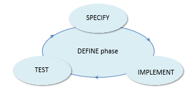
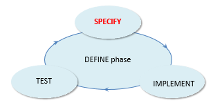
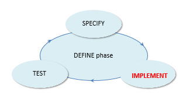
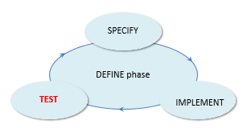

# The DEFINE tasks

The tasks to be completed in the DEFINE phase are SPECIFY,  IMPLEMENT and TEST:  

## SPECIFY

SPECIFY is a task type in the DEFINE phase.

Completing a SPECIFY task leads to a **specification.** Specifications in USoft typically take the form of an SBVR vocabulary of terms, definitions and business rules, complemented by diagrams and other artefacts where necessary. In these formats, they are easy for a wide range of stakeholders to validate. These formats may be used as early as at Business Orientation time (in the PLAN phase).

Implementations without specifications are difficult to maintain. Without specifications, six months after delivery, it is hard to find why implementations have been built the way they are, what functionality is located where, and what the intended use was.

## IMPLEMENT

IMPLEMENT is a task type in the DEFINE phase.

Completing an IMPLEMENT task leads **implementations**, which include **structure, rules** and interfaces. In iterations of the DEFINE phase, implementations are tested and possibly changed until they pass all tests and work according to the specification.

The details of the IMPLEMENT task are not described here because they are the subject of most of the USoft developer product documentation and courseware.

## TEST

In the USoft Approach, TEST is a task type in the DEFINE phase.

You need to test both specifications and implementations.

Testing specifications consists of having them validated by stakeholders such as domain experts, and comparing the specifications against implementations if you use both and have a structured approach to linking them (all of which USoft recommends you do).

Testing implementations is a different matter. There are different types of implementation tests, all part of the DEFINE phase. In the USoft Approach, an implementation is NOT considered complete until future users or their representative have been able to perform an acceptance test and have confirmed that the test went OK.

As part of the DEFINE phase, then, you need to organise the transfer (delivery) of all implementations from the Development environment where they were created to an Acceptance Test environment. That environment must have the same technical characteristics of the prospective Production machine. It must also preferably have realistic end user data – in many cases a viable strategy is actually to COPY all the data currently in Production. This approach is the only way in which you can test the delivery process ahead of time.

In a USoft context, which is often data-intensive, experience shows that if you do not test the delivery process ahead of time, data conversion routines necessary at Release time are likely to be a liability.

Tests should be performed all the way through a DEFINE phase. As soon as you have implemented an item, test it, and then have a colleague test it.

**Types of implementation test**

**Unit tests** check that a very specific, often technical, aspect of an implementation works correctly. A unit tests can often be automated by recording it in USoft Benchmark. Automated tests are easy to rerun them after the application has changed to check whether the behaviour is still correct: **regression testing**. Unit tests must look at everything "on a square millimeter". A unit test must prove that a text-based feature works with the entire range of special characters that it should support. It must prove that a browser-based UI feature works properly on all supported browsers and devices.

**System test** is a generic term for tests that do not look at features in isolation but that check to see whether new or changed implementations have any unwanted impact on interrelated other behaviour. USoft rule implementations have the advantage of immediately activating each other, so that unwanted impact is likely to be noticed even without specific system tests being defined and run. For example, a change made to a Logical View used by a REST service is automatically flagged as invalid until it is next checked for correctness.

**Use case tests** simulate typical end user behavior. The end user could be a human user but also a machine that calls a service or a batch job in a particular way.

**Acceptance testing** is performed by future end users or their representatives. Acceptance testing should be done as the last step in the production of a set of features that together constitute an interation of the PLAN, DEFINE and DELIVER phase – one release version, that is. It must take place on a different machine than where the implementations were created, so that the delivery path to that machine is part of the test.

Tests discussed so far are functionality tests. **Performance tests** are in a different category: they are used to find out whether specific functionality runs quickly enough. USoft Benchmark has a number of special features such as the grouping and reporting of elapse times. **Stress testing** answers the question whether a solution still works, and at an acceptable speed, if many concurrent requests occur, or if they concern large volumes of data. **Security tests** prove that the solution has a required level of anti-hacking defense.

In the USoft Approach, the only types of test that are not part of the DEFINE phase are the **confidence test** and the **release test** carried out as part of a release (in the Release subphase of the DELIVER phase).