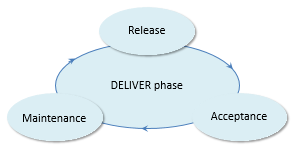
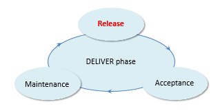
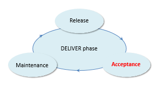
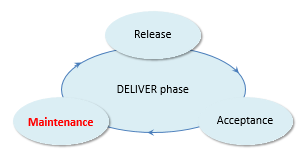

# The DELIVER phase

In the DELIVER phase, the deliverables realised in the DEFINE phase are launched in the organisation - they are taken into production.

The DELIVER phase encompasses everything the organisation needs to do to make sure that the new system and its environment continue to operate properly (the Maintenance subphase).

In spite of the arrows in the picture, the DELIVER phase does not normally show many circular iterations from Release through Acceptance to Maintenance:

- Typically, for each PLAN - DEFINE - DELIVER iteration, you only perform a single Release - but you might repeat the Release step if major problems are found after the release (*hotfixes*). 

- After the first release in the history of an application, the Maintenance subphase becomes typically an ongoing, relatively independent process.

## Release

Release is a subphase of the DELIVER phase.

In the Release subphase, specifications and corresponding implementations are actually made available to the community of end users (humans or systems or both). Typically, this routine is performed exactly once for each iteration of USoft Approach's PLAN – DEFINE – DELIVER cycle, and each time all the released components are tagged to a specific version number.

Of all the subphases in the USoft Approach, the Release subphase is the most concentrated in time. It can often be completed within 48 hours. It is also the most important subphase: all the activities in the PLAN phase and the DEFINE phase lead up to it. Every effort to make the release as simple and risk-free as possible should belong to the DEFINE phase, not to the Release subphase itself.

In the case of specifications, Release involves earmarking each specification as being included in this Release Version and publishing the content. Often a physical copy of the specifications is made in a somewhat different form, maybe a PDF document or a set of HTML pages, and installed at a specific location such as an Intranet location or document server.

At the level of implementations, Release is similar to a classic software release. All defined and coded artefacts are transferred to a Production server or (in C/S solutions) distributed to a number of Production workstations. Usually, the following key steps must be performed when doing an implementation release:

- **Notifying** end users in the Production environment of the impending release, possibly by informing them of new and changed functionality, and maybe even training them ahead of time.
- Performing a final **confidence test**. If performed, this should be the ONLY test performed as part of the DELIVER phase. A confidence test is usually done by making a temporary copy (image, shapshot) of the entire Production server to some other server and performing the entire Release routine as it has been prepared, then checking if there are any unwanted effects, especially in the area of upgraded data.
- **Closing down** the Production server or system(s) at the announced time.
- Actually **transferring** all the prepared materials to the Production server or systems. This includes running one-time data conversion scripts that may be needed to bring existing Production data in line with new or changed rules. It is this data conversion that is the most error-prone element in many USoft releases and therefore, in the USoft Approach, this step will have already been tested at the end of the DEFINE phase and again during the confidence test.
- Doing a cursory **release test** after the transfer to detect any problems that are easily visible at this point.
- **Bringing the server back up** (or, in the case of a traditional C/S application, distributing new flat files) and notifying end users that the new system is available.

## Acceptance

Acceptance is a subphase of the DELIVER phase.

During the Acceptance subphase, tasks are performed that ensure that the released specifications and implementations are in fact successfully incorporated in the daily routines that human end users and digital systems go through as they make use of the released materials.

:::danger

The Acceptance subphase must be clearly separated from acceptance testing, which occurs in different subphases and is a different activity with a different goal altogether.

:::

If you overlook the Acceptance subphase, end users or administrators of digital agents may not know that something was released, or they may not understand how it is supposed to help them. They may continue to prefer alternatives that they are already familiar with - maybe the very alternatives that the release was trying to replace.

The verb "accept" must be taken in the sense of "embed in daily practice", rather than in the sense "agree with".

The following key activities could be part of an Acceptance subphase. They must accompany a Release subphase. Most of them will occur just after the release itself, but they must be identified and prepared ahead of time.

- Publishing **documentation** (traditionally referred to as "release notes") that identifies what has been added and changed in the release, and explains how this new functionality works.
- **Inviting** end users to take advantage of new features, perhaps by publishing online tutorials or attractive video introductions or (if necessary) organising formal training.
- **Monitoring** the successful use of new features by inspecting system log files and data. This is especially important for new functionality used by other systems, but also for functionality used directly by humans. Techniques for monitoring human use range from questionnaires and interviews to observing in person (in the case of implementations) how end users perform tasks or (in the case of specifications) why and how they look up and find, or miss, information.

## Maintenance

Maintenance is a subphase of the DELIVER phase.

The Maintenance subphase of the USoft Approach corresponds to the classic software maintenance tasks that most practitioners are familiar with.

After badly conducted releases, the cost of Maintenance can be very high. It is the aim of activities in the DEFINE phase to prepare a clean release and avoid Maintenance cost.

Tasks in the Maintenance subphase are often performed by a helpdesk. They include:

- Handling support calls, reproducing bug reports and interpreting enhancement requests.
- Registering all ensuing communication with end users.
- Monitoring system use and preventing calamities due to system failure, memory shortage, hacking attempts or problems with installed software.
- Optimizing and maintaining the system infrastructure, for example by running a mirrored fail-over system, executing upgrades of installed software, etc.
- Facilitating and controlling access by extending licenses, adding or dropping authenticated users, etc.