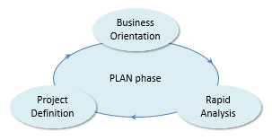
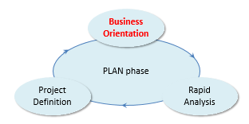
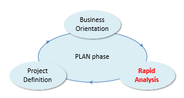
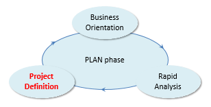

# The PLAN phase

In the PLAN phase, you prepare the delivery of a set of specifications and implementations.

 

To plan this work successfully, you need to identify stakeholders, talk to them, and find out what their most pressing needs are (the Business Orientation subphase). It is clearly established by recent developments in the field of Requirements Analysis that this is not simply a question-and-answer game. Stakeholders are unlikely to articulate their real needs unless you help them by expressing assumptions about target specifications very clearly, so that they can validate these. Also, they need to be confronted with storyboards or working software prototypes to give them a clear idea of what is being planned (the Rapid Analysis subphase).

More practically, you also need to plan the organisation of the work, in other words, you need project management. The USoft Approach is agnostic about the project management methods and techniques, but the need for them is identified (as the Project Definition subphase).

## Roles in the PLAN phase

In the Project Definition subphase of the PLAN phase, you need to organise human resources for the work. This includes **role assignment**: deciding who is responsible for what. Some organisations give you much leeway. Others have strict hierarchies for associating individuals and departments with tasks. They may distinguish for each chunk of work who is responsible, who is accountable, who is consulted or informed... perhaps by using a RACI matrix.

The USoft Approach is neutral with respect to role assignment. Sometimes a business analist is responsible for the tasks of the PLAN phase. In other situations, a rapid development team has this role.  

In Scrum, Business Orientation is assigned to a Product Owner. Project-oriented tasks are assigned to a Scrum Master; these are related to, but do not coincide with the Project Definition subphase. Rather, a Scrum Master has a continuous practical responsibility to facilitate tasks in the DEFINE phase.

When working with Scrum, it is tempting to associate the Product Owner with the PLAN phase and the members of the Scrum team with the DEFINE phase, but this does not give optimal results. In particular, the Scrum team must not be left out during Rapid Analysis tasks; their knowledge and skills are essential to conducting Rapid Analysis successfully.

## Business Orientation

Business Orientation is a subphase of the PLAN phase.

Business Orientation consists of fact finding and interpretation. Its purpose is to get a general picture of the work that needs to be done in the next DEFINE phase. This involves identifying all the stakeholders and talking to them to find our what are their needs and expectations.

- At management and decision-making levels, these expectations are about budget planning and the objectives that were set when reserving budget or raising funds for the work.
- At functional levels, these expectations are about functionality: subjects fields covered, functions covered or supported by software.
- At operational levels, these expectations are more practical: specific software features, such as the user-friendliness of error messages or the level of comfort and attractiveness of human interfaces delivered in a previous cycle.

In addition to drawing up a program of work, Business Orientation must also address the following aspects of preliminary analysis:

- Preconditions. Are facilities and logistics in place? Do participants have the required skills and authority? You may find that measures must be taken or procedures started before the work in the DEFINE phase can start. Or you may find that the expected work is simply not feasible under the given conditions.
- Essential requirements. Have all stakeholders been heard? Does the work involve new connections to existing other software systems or other departments, and if so, can these other systems and departments supply the information you need?
- Scope creep must be avoided from the start. It is helpful to state clearly a number of related deliverables that are NOT included in the work iteration. Statements that formulate that something is out-of-scope may be termed **exclusions.**

**Deliverables**

The Business Orientation subphase must result in a general description of the functionality, scope and proposed approach of the work that has been validated by talking to key stakeholders. Such a description is produced outside the USoft product set. It could have a conventional document format. In a Scrum project, the Business Orientation and Rapid Analysis subphases could together result in high-level user stories.

## Rapid Analysis

Rapid Analysis is a subphase of the PLAN phase.

Rapid Analysis takes the deliverables of Business Orientation as its starting point. During this step, a global analysis is performed so that the result of the Business Orientation is further clarified. Misunderstandings and inconsistencies must be cleaned up. Key terms must become well-defined. It must become clear which possible solution directions there are, and which of them is preferred.

Rapid Analysis is the only subphase in the PLAN phase during which the USoft toolset is put to use:

- At specification level, SBVR definitions-of-terms and business rules may be formulated and submitted for approval. Depending on the methods and techniques selected for analysis, different types of high-level diagrams may be drawn, for example, high-level BPMN diagrams sketching target process flow. Or you can use more informal techniques such as storyboards, wallcharts and sketches.

- At implementation level, working prototypes may be created in USoft and shown to stakeholders. This will create an early opportunity for feedback. It will help identify wrong expectations and technical problems at a time when it is still easy and cheap to remove them.

**Deliverables**

On the basis of findings from the Rapid Analysis subphase, Business Orientation deliverables may be edited and enriched. Depending on techniques used, deliverables of the Rapid Analysis subphase may also include artefacts: prototypes, diagrams, storyboards or sketches.

Deliverables made during Rapid Analysis must remain available during the DEFINE phase. The default way of working with USoft is that actual USoft software prototypes are taken to be the first or 'alpha' version of the evolving new specifications and functionality.

In a Scrum project, the Business Orientation and Rapid Analysis subphases could together result in high-level user stories.

## Project Definition

Project Definition is a subphase of the PLAN phase.

During Project Definition, a specific plan of attack is made for the execution of the work. This includes budget, resources, logistics and milestones planning: it is what most project management methods and techniques mean by the **planning**.

The USoft Approach is agnostic when it comes to methods and techniques for project management.

Project Definition is concerned with the **process** of achieving the target situation, as opposed to the nature of the **contents** of the work. If the organisation is well-versed in applying an Agile framework such as Scrum, the process design for upcoming work (**sprints** in Scrum) is already predefined and the facilities, human resources and skills are already in place.

**Deliverables**

Project Definition must result in a planning that details the project budget, work calendar, target deliverables, resources, logistics and milestones. Depending on the project management techniques chosen, it may include a more or less detailed analysis of risks and opportunities. Project Definition deliverables must be of substantial help to the person or persons responsible for meeting deadlines and ensuring that key objectives are met. Their format may range from conventional documents and spreadsheets to colour-coded plan boards or (in Scrum) sprint boards.