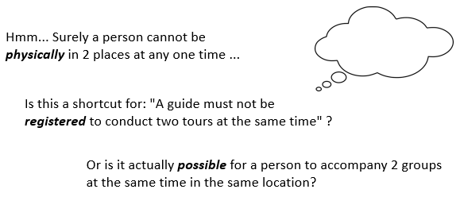
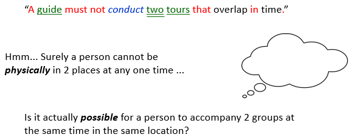
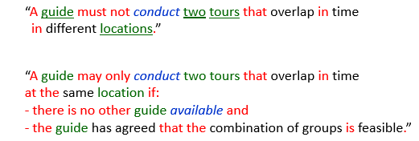
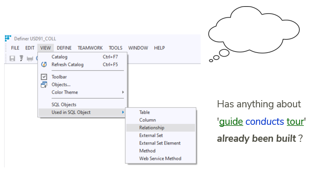

# Why business rules?

USoft advocates business rules as the primary format for expressing and communicating specifications. It has 4 principal reasons for this:

|**Reason**|**Explanation**|
|--------|--------|
|A business rule is atomic|A business rule is only a small piece of logic. It is a single node in a network of mutually dependent constraints. If you change one rule, the other rules still apply: you can change a rule without having to reconsider all neighbouring rules.Compare this with changing a more complex structure such as a business process flow or a decision table. There, each time you change something, you must reconsider the impact of the change on the entire structure.|
|A business rule is inviting to validate|A business rule is a logical proposition. It is couched in terms that allow a reader to say whether it is true or false. This makes business rules inviting to validate for domain experts.|
|A business rule is easy to use|A business rule is a compact statement with a minimum of complexity. It is written in natural language: there is no learning curve for any of the stakeholders. In its purest form, it is a short text, so it is ideal for presentation on a hand-held or wearable device.|
|A business rule is a perfect fit for a Rules Engine|USoft has a Rules Engine: a software component that organises logic in terms of rules. This makes business rules a perfect fit: 600 interdependent business rules can be implemented as 600 rules-based, interdependent software units: when a rule changes, all you need to do is change the corresponding software unit.Another, related benefit is that business rules are based on a concept model, a network of noun concepts and verb concepts, and that USoft software units are data-oriented, based on a data model that easily maps to this concept model. Because of the natural mapping between concept model and data model, it is easy to trace rules and related software implementations simply by looking at the concepts and data constructs they are based on.|


## Business rules reflect a thought process

A business rule formulates an insight. It is expressed in natural language, the most typical format in which humans represent "what goes on in someone's head". Business rules represent a through process that is set in motion by communication between development team members, client representatives, and business stakeholders.

*Example*

A travel agency states this business rule:


This is an extremely natural way to state, in natural language, some situation that would be incorrect or undesirable.

At the same time, this is also something that requires further detail. On the face of it, it states something trivial: a person cannot be in 2 places at the same time. So there must be a reason why stakeholders take the trouble to express this.

This sets in motion a thought process and, hopefully, a discussion among stakeholders:



The answer to these questions will help decide at an early stage how software must be implemented, and to avoid misunderstandings about how business is meant to be conducted.

## The importance of terms and definitions

To get the questions answered, it is essential to recognise that the key words used in the business rule are **business terms** that are standardised elements of the business (they make up the **business vocabulary**) and that require a good **definition.** For this reason, the USoft Studio tool is specialised in presenting definitions wherever they are needed:


## The USoft shortcut: rules are about data if you do not state anything else

USoft applications are *data-intensive* and *data-oriented* by nature*.* They are designed to hold structured business data in a well-designed data structure.**This allows USoft to take a shortcut: it assumes by default that when you state a rule, you really mean that data stored in the software must satisfy that rule.

The earlier question whether the rule below was about *registration* therefore becomes unnecessary. It is never necessary to convert a rule to talk about data registrations: that is understood. USoft can take a shortcut: if the rule means that a person cannot be associated as a guide to 2 tours that overlap on the calendar, that means the software must guarantee that *no such situations are allowed to exist in the data* managed by the software.


If the answer to the last question is "Yes", then this example can be used to illustrate that in USoft, by default, desired business conduct as expressed by business rule is taken to mean *desired data integrity.* The rule is, by default, implemented by a SQL statement that defines data that violates the rule:

```
select         ''
from           tour t1
,              tour t2
where          t2.tour_id != t1.tour_id
and            t2.guide    = t1.guide
and            t2.start_date between t1.start_date and t1.return_date

```

## Business rules as an instrument for detailing business conduct

The thought process triggered by the business rule also allowed a different alternative:



Say, the answer to the last question is "Yes, if ...". It is imaginable, for example, that a person could very well guide 2 groups at the same time if those groups were visiting the same tourist attraction together. This insight could trigger a discussion leading not directly to different *software requirements* but, rather, to *new business rules* that stakeholders had not considered so far. A development team could ask: under what conditions is it possible for a guide to accompany 2 groups of people at the same time? Business stakeholders could reply that guides themselves know local circumstances best, so that they must be put in a position to agree (or not) to accompany 2 groups at the same time. Also, they could reply that this is a last resort: if there is a second guide available, it is better to give each group of tourists its own guide. This could lead to a refinement of the original rule:



This example shows the added value of using business rules for software requirements. Instead of just discovering how the software must work, the discussion continues to address *business conduct,* independently of the software to be developed. This leaves open the possibility to refine the business, instead of just the software requirements.

## Business rules relate to fact models and data models

Business rules talk about facts. In the travel agency, the reality that a certain person conducts a certain tour as a guide is a type of fact (this is also called a *fact type*): it is an occurrence of the concept 'guide *conducts* tour'.

In the same way that business rules build on a well-defined concept structure of fact types, USoft software implementations are built on data models where facts are stored as instances of *relationships* between such objects as 'guide' and 'tour'. The concept structure underlying business rules maps easily to the data structure underlying USoft software implementations. This easy mapping has a variety of benefits. USoft Definer is able to offer features that allow you to trace, in a large application, which software artefacts use this specific relationship 'guide *conducts* tour'. This helps development teams to see readily whether something has already been built to support this type of fact, and if so, where it is located in the code:



 