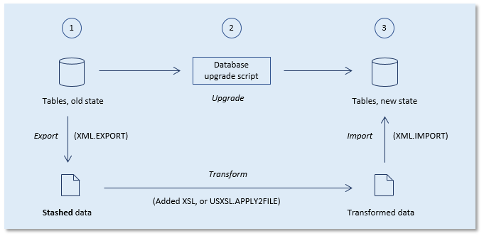

# Stashing

*Stashing* is the process of making a safe temporary copy of production data that is in danger of getting lost during upgrade. Before the upgrade, you stash the data. After the upgrade, you re-import it in a different form. Delivery Manager proposes a standard way of implementing "stashing", which is to export the data to an XML file in a pre-upgrade script (using INVOKE XML.EXPORT), then to change its name or form (or both) by applying an XSLT transformation, and then to re-import the data from XML in a post-upgrade script (using INVOKE XML.IMPORT):



This default implementation of "stashing", however, is not always ideal. There could be performance or storage penalties if the volume of the exported, duplicated data is very large. There are numerous alternatives. To prevent data export but still rename an ADDRESS column to a HOME_ADDRESS column, you could plan as a first step to add the new column, then have the RDBMS duplicate the data from the old to the new column, and then drop the old column. The drawback of such a procedure is that the Rules Engine is bypassed so that you need to validate data integrity after the fact.

## Implementing "stashing"

Follow these steps to prepare stashing and reclaiming data on target machines during upgrade, using the default XML/XSL implementation :

1. In the Computers window (choose Define, Computers from the menu), specify what is the stash location on each computer of interest.

2. In a **Pre-upgrade** script, using a **${stash}** target variable to identify the stash location, include an XML.EXPORT statement that writes the data that you want to preserve to a stash file. The SQL will typically look like this:

```
INVOKE XML.EXPORT WITH 
SELECT     '${stash}\mystasheddata.xml' WriteOutputTo
,          query

```

For example, to preserve the entire contents of a table called MYPARAMETERS, the SQL will look like this:

```
INVOKE XML.EXPORT WITH 
SELECT   '${stash}\Parameters.xml' WriteOutputTo
,        *
FROM MYPARAMETERS

```

3. Implement the transformation:

- Either by adding XSL to the XML.EXPORT statement, or
- By inserting an explicit INVOKE USXSL.APPLY2FILE statement in your Pre-upgrade or Post-upgrade script, in which case you can use the **${stash}** source variable in some or all of the (3) arguments.

4. In a **Post-upgrade** script, include an XML.IMPORT statement that picks up the transformed data after upgrade. The SQL will typically look like this:

```
INVOKE XML.IMPPORT WITH
SELECT     '${stash}\mytransformeddata.xml' 

```

For example, to pick up new Parameters, write:

```
INVOKE XML.EXPORT WITH 
SELECT   '${stash}\NewParameters.xml'

```

You are now ready to check the scripts, run the Release Scripts task, and distribute the result to target machines. On each target machine, stashing will execute correctly if the scripts are run in the order indicated by the sequence numbers in the filenames.

Stashing is an operation that combines multiple different steps, so it must be tested properly at the time when you prepare the upgrade scripts in Development.

## Tips for testing stashing

The following are tips for testing the default XML/XSL implementation of stashing outlined in the " Stashing " help topic.

### Identify the statements using Descriptions

Write the statements in the Pre-upgrade and Post-upgrade scripts. For traceability, make sure you identify the subject of the operation in the Descriptions field. For example, to stash, upgrade and re-apply the contents of a table called Parameters, write "Parameters" in the Description of the XML.EXPORT statement and also in the description of the XML.IMPORT statement.

### Prepare to revert to the old situation

In the database where you test, it must be easy to re-initialise the test: to revert all the data to the pre-upgrade situation so that you can run the test repeatedly. Use one of Delivery Manager's data management actions to clear all the data and re-import a dataset stored on file.

### Having the scripts checked

When you have finished writing the statements, have both the Pre-upgrade and the Post-upgrade script checked (press the Check button in the Current Upgrade Scripts window).The **Pre-upgrade** script must be checked against a repository that contains the "old" version of the application. You must identify this repository by setting the "Source for pre-upgrade check" Application attribute (choose Define, Applications from the menu). You could use the test repository, but in that case you must have the discipline to always re-initialise test data just prior to having the pre-upgrade script checked. If possible, it is better to use a different repository that you know will contain the previous version of the application.The **Post-upgrade** script must be checked against a repository that contains the "new" version of the application. You must identify this repository by setting the "Source for post-upgrade check" Application attribute. Typically, this will simply be the repository where you are developing your stashing scripts.

### Test the Output Statements

When the scripts are checked, in the right bottom corner of the Current Upgrade scripts window, select the Output Statements. Copy and paste the XML.EXPORT Output Statement from the Pre-upgrade script and run it in SQL Command in the test database account.

The next step is to upgrade the test dataset by running the create-tables script. In parallel, make sure the stashed data is transformed:

- If you implemented the data transformation using added XSL, the XSL is already included in the Output Statement.
- If you implemented the data transformation using USXSL.APPLY2FILE, you need to run also that Output Statement.

The last step is to reclaim the stashed and transformed data. Do this, again, by cutting and pasting the Output Statement for the XML.IMPORT statement in the Post-upgrade script.

This is only a general indication of how to proceed. In practice, the variations are endless: depending on your situation, it may be necessary to execute not just the Output Statements of the XML.EXPORT and XML.IMPORT statements, but also of other surrounding statements in the scripts that are immediately related.