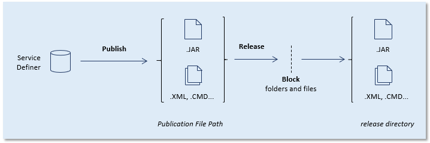
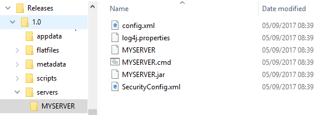

# Extracted server objects in UDeliver

> [!NOTE]
> This article is about the **extracted server object** concept in USoft Delivery Manager ("UDeliver”).

An *extracted server object* contains all the information necessary to release a Server. Some of this information is extracted, in other words, retrieved from the Service Definer instance where the Server is defined.

## Extracting servers

When you extract servers from a database account, you get a list of Server names defined in that account in Service Definer. These names are registered in Delivery Manager as Server Objects, initially with the same names as the Servers found.

You can edit the Server Object names but not the Server names. There is usually no point in editing a Server Object name and making it different from the name of the Server it represents, except:

- In the (perhaps unlikely) event that you have different Servers with the same name in different locations, or:
- If you want to convey something special to your deployers by the Server Object name. This name becomes the name of the subfolder of the release folder where the server deliverables are placed.

Each time you extract servers, their current Publication File Path is also (re)copied from the Service Definer where they are defined.

It is good practice to re-extract servers just before you release them. This is an easy way to find out whether they still exist by the same name, and whether or not their publication path has changed. For this reason, Delivery Manager's Release server action automatically re-runs, as a first step and a last double-check, the Extract servers action for the associated database account.

## Releasing a server

You release a server by releasing a Server Object. When you do this:

- Delivery Manager logs on to Service Definer where the associated Server is defined, and publishes the Server in the normal way, using the Publish Server feature. The output is written to the server's Publication File Path as usual.

- Delivery Manager copies the publication result from the Publication File Path to release subfolder:

```
\servers\server-object
```

In this routine, the Publication File Path is relatively unimportant since it is reduced to an interim directory. In Delivery Manager, you can block folders and files: blocked folders and files remain in the Publication Directory but are not copied to the release subfolder:



Publication and release of a server from Service Definer by Delivery Manager

The output of releasing a server is placed in a release subfolder that has the same name as the Server Object. If this name is MYSERVER, the "servers" release folder could look like this:



##  