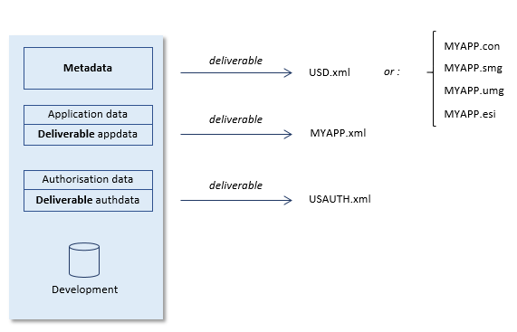

# Metadata and application data in UDeliver

:::note

This article is about the **metadata** and **appdata** (for: application data) concepts in USoft Delivery Manager ("UDeliver”).

:::

USoft Delivery Manager distinguishes between *metadata* and *application data*, or *appdata.*

|**Type of data**|**Description**|
|--------|--------|
|Metadata|Data that describes your USoft application. You create this data by using USoft Definer and (where applicable) USoft Windows Designer or USoft Web Designer.|
|Application data|Data that your USoft application allows its users to enter, or view, or manipulate.Data created in USoft Authorizer, USoft Benchmark, USoft Service Definer, and USoft Delivery Manager.|

There a five types of application data:

|**Type of appdata**|**Description**|
|--------|--------|
|User application data|Data that your USoft application allows its users to enter, or view, or manipulate.|
|Authorisation data|Data created in USoft Authorizer.|
|Test data|Data created in USoft Benchmark.|
|Service Definer data|Data created in USoft Service Definer.|
|Delivery Manager data|Data created in USoft Delivery Manager.|

## Deliverability

Metadata is deliverable by definition. It must be released to target machines if the application is to run successfully on those machines. Delivery Manager releases metadata either as an XML export named "USD.xml" or as conventional USoft flatfiles (named "MYAPP.con" etc. if your application is called MYAPP). You can also choose to have the same metadata released in both formats in parallel.

User application data are *deliverable* if that data is determined by the development team in the Development environment as part of the software being delivered, as opposed to being created or manipulated by end users in Production. In practice, only a small set of 'technical tables' in your application will be deliverable USoft Delivery Manager releases deliverable application data as an XML export file named "*application*.xml", for example, "MYAPP.xml" if you develop a user application that is called "MYAPP".

In practice, an important part but not all of your authorisation data will also be deliverable. USoft Delivery Manager releases deliverable authorisation data as an XML export file named "USAUTH.xml".

Many different scenarios are possible. Typically, you are confronted with the need to deliver at least:

- Metadata,

- Deliverable user application data,
- Deliverable authorisation data,

where metadata is either delivered in XML or in flatfile format, and application and authorisation data in XML:

Delivery Manager releases XML exports named "USD.xml" in the **metadata** section and conventional USoft flatfiles (named "MYAPP.con" etc. if your application is called MYAPP) in the **flatfiles** section. Deliverable application data and authorisation data are released to the **appdata** section.

If you instruct Delivery Manager to release .xml data files, and comparable data from a previous release are found, then Delivery Manager will automatically produce a *diff file* with name "...diff.xml" (with the "diff" infix at the end of the filename and before the file extension). Each *diff file* is the outcome of a comparison between the metadata of the current release and the metadata of the previous release. Both the regular XML exports and the *diff files* are re-importable. The regular .XML files contain static datasets. The *diff files* list differences detected as INSERT and UPDATE operations (ie, new and changed records) as static data, and differences detected as DELETE operations (ie., dropped records) as data with the transition instruction <Delete/>.

If the release is initial, ie., the first release in the release tree that is known to Delivery Manager for the application, then Delivery Manager will release a dummy XML file named "... initial.xml" that denotes an *empty* repository. This causes the *diff file* to report the comparison with the next state as an INSERT (introduction) of all the records present in that state.

|**Type of data**|**Section**|**Filename**|
|--------|--------|--------|
|Metadata|metadata|USD.xmlUSD.diff.xml(USD.initial.xml)|
|flatfiles|MYAPP.conMYAPP.smgMYAPP.umgMYAPP.esi|
|user application data|appdata |MYAPP.xmlMYAPP.diff.xml(MYAPP.initial.xml)|
|authorisation data|USAUTH.xmlUSAUTH.diff.xml(USAUTH.initial.xml)|

## Metadata

Metadata released as conventional USoft flat files (MYAPP.con, etc.) is intended for target environments that are to run from flat file. These flatfiles can be deployed on a target machine by replacing the old flatfiles (if they exist) by the delivered flatfiles.

Metadata released as an XML export file (called "USD.xml") is intended for target environments that are to run from repository. This data must be deployed by being re-imported into the target repository. While "USD.xml" files produced by Delivery Manager are re-importable in principle, this may raise problems if the target repository already has metadata from a previous release, unless it is possible and acceptable to clear the target repository as a preparatory step. Alternatively, the target repository may be upgraded by importing the "USD.diff.xml" file into it, rather than the "USD.xml" file.

## Deliverable authorisation data

USoft Authorizer takes the form of a configurable layer that runs from repository in each environment. The implication is that, in theory, administrators on a given Production machine can decide, independently of the development team and of the moment when the application is released to that target machine, not just who (which individuals) is allowed to access the application and in what role and for how long, but also which roles (usergroups) there exist in the first place, and what data and other functionality each role has or not does have access to.

However, in practice, this kind of authorisation is so closely linked to application logic determined by the development team, that in production applications most USoft Authorizer data are actually deliverable data: they are determined by the development team in Development, delivered by Delivery Manager, and not supposed to be manipulated by end users or by administrators on Production machines. The only exception in practice is that administrators determine WHO (which individuals) is allowed to access the application on a given Production machine, IN WHAT CAPACITY (of which usergroup each of these individuals is a member), and DURING WHICH TIMEFRAME.

In summary, while deliverable application data is usually a very small part of application data, by contrast the greater part of authorisation data created in USoft Authorizer is usually delivered. Delivery Manager presents a list of authorisation tables in which you can indicate which tables are deliverable by checking or unchecking a check box for each table. By default, Delivery Manager presents as checked all the boxes for the authorisation tables that are usually delivered from Development.