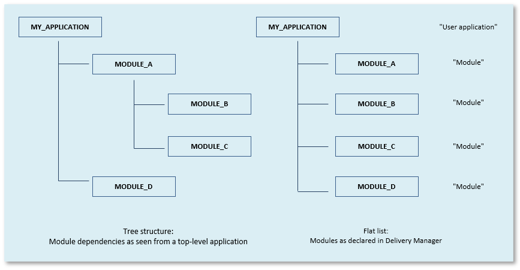

# Modules in UDeliver

> [!NOTE]
> This article is about the **module** concept in USoft Delivery Manager ("UDeliver”).

## How to deliver modules

### Registering modules in UDeliver

In UDeliver, you can keep a list of modules run by your user application. Choose Define, Applications from the UDeliver menu, then click the Modules tab. When you release, this is where Delivery Manager looks to determine what module deliverables to include in the release.

Why keep this list if you already have a list of these modules in USoft Definer? Because this allows you to define which module deliverables UDeliver should include in your application release when you call the [Release modules](/docs/Continuous_delivery/Delivery_Manager_actions_by_name/Release_modules.md) action. At that time, UDeliver needs to know 2 things:

- **Root folder:** The location in the file system where it can find the module's deliverables.
- **Version:** The version of the module that you want to include in the release.

> [!TIP]
> Module information in UDeliver does not have an impact on anything else than calling the “Release modules” action.

If your user application runs a module, make an arrangement with the team who develops the module. Make sure they have made the necessary deliverables available for the version of the module you want to include in the release. These deliverables will include flatfiles and a create-table script, and possibly also upgrade scripts, metadata XML files, and other deliverables. Module deliverables must be placed in a specific folder on a filesystem: the module's Root Folder, typically a shared folder. If the Root Folder is:

```
\\fs.mycompany.com\module_M1
```

then version 4.5 of the module deliverables should be made available in folder:

```
\\fs.mycompany.com\module_M1\4.5
```

### Releasing modules from UDeliver

To actually (re)release the module deliverables, as part of your release task, run the [Release modules](/docs/Continuous_delivery/Delivery_Manager_actions_by_name/Release_modules.md) action for the user application that runs the modules.

### Release history

UDeliver supplies a read-only *release history.* This allows you to trace which versions of which modules were included in which version release of your user application. Choose Release, Release history from the UDeliver menu to discover this information.

## Background: How UDeliver sees modules

### Modules as a tree structure

A USoft application can run any number of modules. Each module is developed away from the application that runs it: in a development repository of its own.

A module can, in turn, have modules of its own. This way, in theory, you can have a hierarchical structure of modules that run modules. This tree structure can be any level deep.

Looking "up” rather than "down”, each given module can be run by multiple other applications. These applications may themselves be modules to a "grandparent” application.

> [!WARNING]
> It’s one thing that an application *runs* a module. This is what is relevant when the application is delivered. An application runs a module if that module is *declared* in USoft Definer with Load Module = Yes.
> It's quite another thing that USoft developers of an application may have access to *interface objects provided by a module.* This is a development-time reality which is relatively unrelated to delivery. A development team has access to interface objects if the module developers have supplied a definition of their work in which interfaces are exposed, and the team has decided to *synchronise* with these interfaces. USoft Definer speaks of *consumed* and *provided* interfaces.
> This article is about runtime delivery of modules, not development-time interfacing with modules.

### Modules as a flat list

You can deliver any structure of modules with USoft Delivery Manager. Delivery Manager does not need to see a tree structure: it does not register exactly how modules depend on each other. Instead, Delivery Manager can keep a list that contains, for a user application running modules, a flat list of modules*:*

