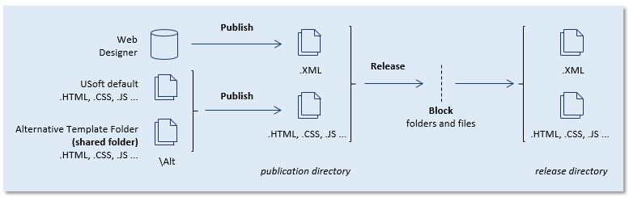

# Publication objects in UDeliver


:::note

This article is about the **publication object** concept in USoft Delivery Manager ("UDeliver”).

:::

A *publication object* contains all the information necessary to release a web application or a page set from Web Designer. It has a unique Publication Object name that identifies it within Delivery Manager but is not known outside it.

You can have a publication object validated to make sure that the information it  (still) matches the situation in the Web Designer source.

It is good practice to have the publication object re-validated just before you release it. For this reason, Delivery Manager's Release publication action automatically re-runs, as a first step and a last double-check, the Validate publication object action for the publication object.

## Validating a publication object

To validate a publication object, you need to define it first. Do this by specifying:

- Its unique Publication Object name.
- A Database Account name identifying the source location where the publication is developed.
- A name that identifies your USoft application. This is the application name you have been using in Web Designer.
- A name that identifies a Publication Configuration in Web Designer.
- Optionally, a name that identifies a Page Set in Web Designer. Leave this empty if you want to publish the entire Application rather than a Page Set.

Next, get this validated by running a Task that executes the Validate publication object for the publication object. You are now ready to use the publication object for releasing publications.

## Releasing a publication

You release a publication by releasing a Publication Object from a database account:

- Delivery Manager logs on to Web Designer in the database account, and publishes the application against the Publication Configuration. If you specified a Page Set, this is what is published. If you did not specify a Page Set, the entire application is published. It is not possible from Delivery Manager to publish a single Page.

- Delivery Manager copies the publication result from the Publication Directory of the Publication Configuration to release subfolder

```
\publications\publication-object
```

In this routine, the Publication Configuration is relatively unimportant since it is reduced to an interim directory. In Delivery Manager, you can block folders and files. Blocked folders and files remain in the Publication Directory. They are not copied to the release subfolder:



Publication and release of web application GUIs from Web Designer by Delivery Manager

## Publishing without releasing

You can also perform this same sequence of operations but write the output to a different location than the release folder. To do this, use the Publish publication object instead of the Release publication action.

## The "Alt folder" or Alternative Template Folder

Web Designer's Publish routine is the operation that assembles web GUI deliverables from the sources and places them in a location called the *publication directory.*

Each time you publish, you extract application GUI definitions from the Web Designer repository to .XML files (one .XML file for each Page that is published). In addition, you publish a set of .HTML, .CSS, .JS and other non-XML files. The source for this set of non-XML files is the USoft-delivered default by default, but files in this set are overwritten at publish times by files and folders of the same name that your team has placed in the Alt (Alternative Template) folder.

This makes the Alt directory the source for non-XML web GUI deliverables.

Therefore, if multiple developers in your team are able to publish the web GUI of your application, **it is essential that you choose is a shared folder on the file system as your Alternative Template Folder**.

When you publish in Web Designer, you must indicate a Publication Configuration against which to publish. Among other things, this Publication Configuration determines the filepath to the Alternative Template Folder and the filepath to the *publication directory* where the output (the publication) is placed. In the context of delivery, this publication directory is used as an interim folder only. It may be a shared folder or it may be a local folder.


:::danger

USoft allows the Alt folder to be a subfolder of the publication directory. This is sometimes practical for small, local test or debug installations because it bundles publication deliverables and the Alt folder within 1 folder on the file system. However, this is bad practice from a delivery point of view and must be avoided in any production project.

:::

 