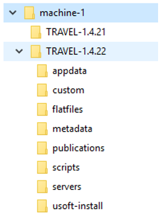

# Sections in UDeliver

:::note

This article is about the **section** concept in USoft Delivery Manager ("UDeliver”).
This concept is only relevant in a release situations.

:::

When Delivery Manager releases deliverables, it places these deliverables in different *sections* which are essentially subfolders on the file system.

The sections that Delivery Manager distinguishes are **flatfiles**,  **appdata**,  **metadata**,  **publications**,  **servers**,  **scripts**, and **custom**:

For example:

- When you call the "Release flat files" action, a collection of flatfiles is generated from USoft Definer, from which your application can run on target machines. These flatfiles are placed in the "flatfiles" section (subfolder) of the current release folder.
- When you call the "Release publication" action, a collection of web pages of a USoft web UI is published from USoft Web Designer. These web pages are placed in the "publications" section (subfolder) of the current release folder, in a subfolder named after the Publication Object that you specified in your call.
- When you call the "Release server" action, a collection of services associated with the server that you specify is published from USoft Service Definer. These services, physically a Java .JAR file and some accessory files, are placed in the "servers" section (subfolder) of the current release folder, in a subfolder named after the server that you specified in your call.

Sections play a role in defining how Delivery Manager handles folders on the file system. Each time you write to a section other than "custom", any existing content is first cleared. Each time you write to a new folder in the "custom" section, that folder is automatically created. For details, go to " Folder management principles ".

You can define attachments for a section. Each time you write to a section, those attachments are included in the section.

A section only comes into play if and when you call a release action that writes deliverables to that section. For example, if you never release to the "servers" section because you do not use USoft Service Definer, no reference to the "servers" section will appear in your deliverables.

## Manually added deliverables

You can add folders of your own. In the following image, a "usoft-install" folder has been added to the section folders:

Release folders contain deliverables and correspond to sectionsA good strategy is to use added folders for *software deliverables*. These could include executables of the USoft runtime platform, but also 3-party software executables, for example for utilities for zipping or converting text files.

It is not good practice to deliver simple file-based deliverables in this way. Use the "custom" section instead.