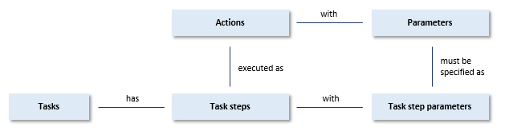

# Tasks in UDeliver

> [!NOTE]
> This article is about the **tasks** concept in USoft Delivery Manager ("UDeliver”).

**See also**

- [Defining a task](/docs/Continuous_delivery/Delivery_Manager_basic_procedures/Defining_a_task.md)
- [Running a task](/docs/Continuous_delivery/Delivery_Manager_basic_procedures/Running_a_task.md)
- [Defining a task category](/docs/Continuous_delivery/Delivery_Manager_basic_procedures/Defining_a_task_category.md)

You can perform delivery and data management operations by defining and then running *tasks.* A task is a series of actions that you perform in a set order. Most actions require *parameters.* For example, when you run the action "Release flatfiles", you must pass a parameter called Database Account to indicate the repository where the flatfiles are to be generated from.

Delivery Manager offers a catalogue of actions from which you can choose. The parameters associated with an action are an integral part of the action. You cannot change actions and parameters: they are set by USoft as part of the Delivery Manager product.

You compose a task by creating a sequence of *task steps.* Each task step performs exactly one action. If the action has parameters, these become *task step parameters* of your task step. You must provide a value for each task step parameter before you can run the task. Some task step parameters are optional: you can choose whether or not to provide a value for them.

Use the Actions catalog on the left-hand side of the screen to inspect available actions and parameters. The best place to get details about a specific action is the " Delivery Manager actions by name " help topic.

Use the Define Tasks window to define tasks or view existing tasks (choose Define, Tasks from the menu).

Use the Run Tasks window to run an existing task (choose Tools, Run Tasks from the menu).

## Task categories

A task must be grouped by *task category*. This way, team members can find it more easily:

- Tasks are automatically grouped by task category in the Tasks tab of the catalog.

- In the Define Tasks and Run Tasks windows, you can query tasks by Task category.

You can define any task categories, using any classification principle or pragmatic titles that seem most fit to your project or way of working.

As a suggestion, you could consider using the same categories for Task Categories as have been used for Contexts to group Actions.