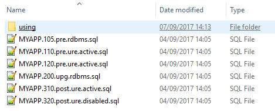

# Upgrade scripts


:::note

This article is about the **upgrade script** concept in USoft Delivery Manager ("UDeliver”).

:::

**See also**

- [Writing an upgrade script](/Continuous_delivery/Delivery_Manager_basic_procedures/Writing_an_upgrade_script.md)
- [Archiving an upgrade script](/Continuous_delivery/Delivery_Manager_basic_procedures/Archiving_an_upgrade_script.md)
- [Restoring an upgrade script](/Continuous_delivery/Delivery_Manager_basic_procedures/Restoring_an_upgrade_script.md)

## Upgrade scripts

An *upgrade script* is an SQL script that is intended be run on a target machine in order to upgrade your USoft application to a new release.

Upgrade scripts produced by USoft Delivery Manager are presented in a specific format that makes it easy for administrators or DBAs on a target machine to know what to do. This picture shows a typical set of upgrade scripts as may be found in the "scripts" section of a release folder:



These scripts, all associated with application "MYAPP", must be executed in the order indicated by the sequence numbers.

The name fragment following the sequence number is either "pre", "upg" or "post". This shows the script's processing order:

- Files with sequence numbers in the range 100 - 199 have "pre". The sequence numbers and the letters "pre" show that these files are pre-upgrade scripts*:* they are to be run BEFORE the create-tables script (if any).
- At most 1 file, always with sequence number 200, has "upg" and is known as the *create-tables script*.
- Files with sequence numbers in the range 300 - 399 have "post". The sequence numbers and the letters "post" show that these files are post-upgrade scripts*:* they are to be run AFTER the create-tables script (if any).

The last name fragment before the ".sql" file extension is either "rdbms", "ure.active", or "ure.disabled". This indicates the script's processing mode*:* an indication that the script must be run against the Rules Engine normally, or against the Rules Engine with all rules disabled, or directly against the RDBMS.

## Upgrade scripts, Processing Order

Choose "Pre-upgrade" to indicate that your upgrade script must run *before* the create-tables script. Choose a unique Script Seqno for each Pre-upgrade script. This Script Seqno determines the order in which operators will run the Pre-upgrade scripts between them. Pre-upgrade scripts are given an external sequence number in the range 100-199.

Choose "Post-upgrade" to indicate that your script must run *after* the create-tables script. Choose a unique Script Seqno for each Post-upgrade script. This Script Seqno determines the order in which operators will run the Post-upgrade scripts between them. Post-upgrade scripts are given an external sequence number in the range 300-399.

|**Processing order**|**Range**|**Example generated filename**|
|--------|--------|--------|
|Pre-upgrade|100 - 199|MYAPP.110.pre.ure.active.sql|
|Create-tables|200     |MYAPP.200.upg.rdbms.sql|
|Post-upgrade|300 - 399|MYAPP.320.post.ure.disabled.sql|


The choice of processing order dictates against which database account a script is checked:

- Pre-upgrade scripts are checked against the database account set as the "Source for pre-upgrade check" for the script's application.
- Create-tables scripts are generated, not checked.
- Post-upgrade scripts are checked against the database account indicated as the "Source for post-upgrade check" for the script's application.

It is easy to determine the "Source for post-upgrade check" database account because this must be the account with the latest state of the data model, ie., the Development account.

Having a "Source for pre-upgrade check" available requires more planning. This must be a database account that has the state of the data model at the time when the application was last released to other machines. This database account could be a Test or Acceptation account or an account especially maintained for checking Pre-upgrade scripts.

If you do not wish to keep 2 different sources for script checking, you can set both attributes to the same (Development) account. However, remember that in this situation, Pre-upgrade scripts will not be successfully checked if they refer to objects that have become obsolete in the post-upgrade data model. Otherwise, consider if it is possible to do without Pre-upgrade scripts altogether.

## Upgrade scripts, Processing Mode

### Processing mode, defining

For each pre-upgrade and post-upgrade script, you must set a Processing mode that indicates how the script must be run on the target machines:

|**Processing Mode**|**Explanation**|
|--------|--------|
|Rules Engine|The SQL commands must be executed as if by default from the SQL Command dialog in the USoft application. All constraints and other checks execute in response to the data manipulation.|
|Disable Rules|The SQL commands must be executed as if from the SQL Command dialog after calling the DeactivateAllConstraintChecks() action. Constraints and other checks do not execute. One difference with the "rdbms" processing mode is that logical view names are recognised and subtype constellations resolved as if the statement(s) was normally executed by the Rules Engine. Another difference is that SQL constructs known to the RDBMS but not to USoft will raise errors.|
|Database|The SQL commands must be executed directly by the RDBMS, using an RDBMS-supplied utility.|


When you define Processing Mode, always consider the Rules Engine option first: data integrity is automatically safeguarded only if you run against the Rules Engine. A reason to choose a different processing mode could be that it speeds up the upgrade operation in cases where you have large data volume on target machines and you are sure that, logically, you do not need the Rules Engine action.

Processing Mode = Database has an effect on script checking. The script will be set to Checked = Yes, but no checking will actually take place. This applies to all aspects of script checking, including SQL syntax checks, checks against the data model, and expansion of any source variables and path placeholders.

If Processing Mode is other than Database, full script checking will be performed. The difference between Processing Mode = Rules Engine and Processing Mode = Disable Rules has no effect on script checking.

### Processing mode, releasing

When you come to release your upgrade scripts, the choice of Processing Mode is reflected in the generated script file names as follows:

|**Processing mode**|**Indicated in script name by**|**Example generated filename**|
|--------|--------|--------|
|Rules Engine|"ure.active"|MYAPP.110.pre.ure.active.sql|
|Disable Rules|"ure.disabled"|MYAPP.320.post.ure.disabled.sql|
|Database|"rdbms" |MYAPP.320.post.rdbms.sql|


The processing mode is also printed as a comment at the top of the contents of each generated script.

### Processing mode, executing

The instruction to administrators or DBAs who are to execute upgrade scripts on target machines must be different depending on the Processing Mode indicated in the script filename and at the top of each script.

**Processing mode = Rules Engine**

The script must be run by opening a USoft client/server instance, opening SQL Command in it, executing the script contents, and committing the transaction. If it is unacceptable to open a USoft client/server instance on a target machine, a custom automation solution must be implemented around the script code, for example:

- The script can be run inside a Windows command which is a call to usd.exe.
- The script can be executed by a Rules Service running as a Windows service.
- The script can be wrapped in a USoft Batch Job.

**Processing mode = Disable Rules**

The top of a generated upgrade script file with Processing Mode = Disable Rules has the instruction:

```
action DeactivateAllConstraintChecks( )
```

In order to run such a script successfully by opening a USoft client/server intance and opening SQL Cmmand in it, the "Allow_Disable_Constraint" parameter of the applicable Deployment Configuration in USoft Authorizer in the target database account must be set to True for the Client/Server context. Delivery Manager facilitates setting or unsetting this parameter by running the "Allow disable constraints" action, but only for database accounts declared in, and directly accessible from, Delivery Manager. Alternatives include setting this parameter for a different context (Rules Service or RunBatch) and making arrangements so that the script may be run accordingly.

**Processing mode = Database**

The script must be run against an RDBMS utility in the same way as the create-tables script (if any). This type of script is usually easy to understand for DBAs, because they are used to running scripts on target machines in this mode.

## Upgrade scripts, Script Status

Each upgrade script is for a specific Application and a specific Version of that application.

Each upgrade script has a *script status*, which Delivery Manager automatically sets to either Current or Archived:

|        |        |
|--------|--------|
|Current |The upgrade script is for the current version of the application, as listed in the Applications window.|
|Archived|The upgrade script is for a version other than the current version of the application, as listed in the Applications window.|


Upgrade scripts are archived automatically when you move to the next release. You can restore archived scripts.

## Range 100: Pre-upgrade scripts

A  *pre-upgrade script* is a script intended to be run, during deployment on a given target machine, just before the create-tables script. A pre-upgrade script runs against an existing (old) database state.

### Do you really need a pre-upgrade script?

You may not need pre-upgrade scripts in your release at all. But every decision to create one must always be made *during development*, at the time when you are conscious of making changes that could affect data upgrades on target machines. It is bad practice to leave these decisions until *release time*.

In practice, the most common use case for a pre-upgrade script is that you want to preserve application data before some structural change is made that causes that data to be lost. A classic example is when you move a column from a subtype table to a supertype table. USoft will drop the column from the subtype, and add it to the supertype, but it will not automatically understand that the *application data* in the old subtype column must migrate to the supertype table.

### Creating a pre-upgrade script

To create a pre-upgrade script, add a new entry in the Current Upgrade Scripts window and :

- Set Processing Order = Pre-upgrade.
- Set a Seqno (sequence number). The sequence number determines in what order pre-upgrade scripts must be run between them.
- Set the script's Processing Mode.

Next, in the SQL Statements box, write the SQL statement(s) that you want your pre-upgrade script to perform. Again, set Seqnos (sequence numbers) to decide in what order these statements are to be executed.

### Checking a pre-upgrade script

Before you can release a pre-upgrade script, you must have it *checked*. Do this by pressing the Check button. If the check is successful, the script is set to Checked = Yes and you are ready to release it.

The script checker performs three important tasks:

- The SQL statement is checked for syntax correctness and correctness against the data model (table names, column names, relationship names).
- source variables and path placeholders (if any) are expanded to absolute and machine-dependent paths.
- For each item of added XSL, a call to USXSL.APPLY2FILE is added so that the XSL will be applied when the released script is run on a target machine.

Delivery Manager will attempt to determine whether a script must be re-checked. For example, if you change a SQL Statement, the script will be set to Checked = No. However, because the data model is in a remote database account and not in Delivery Manager, it is not possible to detect automatically all events that could potentially invalidate a script. For this reason, the "Release scripts" action performs a last-minute re-check of all the scripts before they are released to the file system.

### Releasing a pre-upgrade script

You can release pre-upgrade scripts only by running a Task that executes the "Release scripts" action. Releasing a script consists of compiling the actual script file with file extension .SQL, and placing it in the \\scripts subfolder (the "scripts" section) of the current release folder.

The Release Scripts action is called for all the current upgrade scripts of a given application. You can only release the scripts of an application if there are no remaining unchecked scripts associated with that application.

## Range 200: Create-tables script

The *create-tables script* is a SQL script that is run directly against the RDBMS and that will make all the necessary database changes associated with your release. It will create, drop or alter database tables, database indexes, and (in the case of the Oracle and Sql Server RDBMS) database sequences in order to achieve the database state described by the new version of your application.

A create-tables script produced by Delivery Manager has the file name "*application.*200.upg.rdbms.sql". It is placed in the \\scripts subfolder (the scripts section) of the release folder.

A create-tables script is RDBMS-specific. Delivery Manager is able to generate Oracle and SQL Server syntax.

On a per-table basis, you can indicate that you want a create-tables script to skip the table or to generate a CREATE TABLE (as opposed to an ALTER TABLE) statement. Do this at application table level in Delivery Manager.

Otherwise, you could tailor the create-tables script that Delivery Manager generates to your special needs. This is not recommended unless you have special reasons.

### Do you really need a create-tables script?

A quick answer to this question is: yes, registering a create-tables script for each release is usually a good idea.

People ask this question for different reasons.

Experienced USoft consultants often wonder why Delivery Manager should produce a create-tables script when USoft also allows you to run Create Tables directly (from the context menu of a USoft Binder). When you run Create Tables directly, a comparison is made between the "new" database structure and whatever is found locally, and then database changes are immediately made on the basis of that comparison. That usually works fine, but has major drawbacks:

- The changes applied are not traceable.
- If, for some reason, the existing local database state was different (older) than expected, unexpected errors could occur.
- It may not be practical or acceptable to run USoft Binder on a specific production machine.
- There is no structured way to combine the database changes with (functionally closely related) appdata and authorisation data changes as defined by pre-upgrade scripts and post-upgrade scripts.  There is no structured way to to register that these related upgrade actions have taken place, or are planned to take place.

Others may feel that it is cumbersome to register a create-tables script even for very small releases, where nothing changes in the database.

If you have a policy of registering larger release versions, it is likely that each version will have at least *some* database change. In this situation it is practical, and also best practice, to register a create-tables script for *each* release. Occasionally, you will have a release that does not change the database. In that case, the create-tables script will simply remain empty.

If you have a policy of registering many small release versions (patch releases) that often have very few deliverables compared to the previous release, then you may want to skip registering a create-tables script for such minor releases. In this situation, some extra manual action is required when the next major release comes along that *does* require database changes and therefore a create-tables script. This is because Delivery Manager computes a create-tables script by comparing the current database state to its most recent previous state. It is only able to compute a create-tables script if the *most recent* previous release folder contains an "*application*.USD.xml" file in its "metadata" section that describes the situation before the database changes. Otherwise, the "Release scripts" action will raise the error:

```
Release is non-initial but XML repository file for previous version is not found at: previous-release-location\application.USD.xml
```

where *previous-release-location* is the release folder where "Release scripts" expected to find the description of the most recent database state before it was changed.

### What does a create-tables script contain?

In general terms, the create-tables script contains SQL statements that are understood by your RDBMS and that change the RDBMS tables, indexes and (in the case of Oracle and Sql Server RDBMS) sequences to create the data structures associated with your new application release. A create-tables script may contain DDL statements such as CREATE TABLE, ALTER TABLE, DROP TABLE, CREATE INDEX.

To find out what is in the create-tables script, inspect it. Do this by releasing the create-tables script (see next section below), then finding the "*application*.200.upg.rdbms.sql" script in the **\\scripts** subfolder of the current release folder, and then opening it in a text editor.

The database script attempts to preserve existing data. One strategy it uses for this is (roughly) the following sequence of statements, where existing data is temporarily preserved in an OLD_... table:

```
RENAME mytable TO OLD_mytable;INSERT into OLD_mytable(...) 
SELECT * FROM mytable;
CREATE TABLE mytable (...);
INSERT INTO mytable (...)
SELECT * from OLD_mytable;

```

Another strategy uses ALTER TABLE rather than CREATE TABLE:

```
ALTER TABLE mytable ADD COLUMN ...
```

With ALTER TABLE, existing data is preserved in the table itself while it undergoes change.

USoft automatically decides, on a per-table basis, whether a strategy with ALTER TABLE or with CREATE TABLE statements is applied.

- You can determine that a table is **skipped**, ie, not included in the create-tables script even if it has changed. Do this on a per-table basis by finding the table in the Application Tables window (choose Define, Application Tables) and setting Skip = Yes for the table.
- You can determine that a CREATE TABLE statement is used rather than an ALTER TABLE statement. Do this on a per-table basis by finding the table in the Application Tables window (choose Define, Application Tables from the menu) and setting Upgrade Hint = Create for the table.

If you do not find the table in the Application Tables list, run the " Populate tables list " preparatory action.

### Creating and releasing the create-tables script

You can create and release the create-tables script by running the "Release create-tables script" action. Alternatively, to release in combination with other upgrade scripts, you can run the "Release scripts" action with the "Include physical tables upgrade script" option set to Yes.

Except when your current release is an initial release, a prerequisite is that the "metadata" section of the *previous* release folder contains a file (called *"application.*USD.xml") that describes the previous database state. See the previous section "Do you really need a create-tables script?" for details.

## Range 300: Post-upgrade scripts

A *post-upgrade script* is a script intended to be run, during deployment on a given target machine, just AFTER the create-tables script. Thus, a post-upgrade script runs against an upgraded (new) database state.

To create a post-upgrade script, add a new entry in the Upgrade Scripts window and set Processing Order = Post-upgrade.

### Do you really need a post-upgrade script?

You may not need post-upgrade scripts in your release at all. But every decision to create one must always be made during development, at the time when you are conscious of making changes that could affect data upgrades on target machines. It is bad practice to leave these decisions until release time.

Avoid writing a post-upgrade script that does something that the create-tables script will automatically take care of. For example:

- If you add a new mandatory column and this column has a Default Value, then the "200.upg.rdbms.sql" create-tables script will automatically apply the default value to existing records. You do not need to write a script for this.

In practice, typical use cases for post-upgrade scripts include new calculation rules and data migration.

### New calculation rule

A post-upgrade script may be needed when you have new calculation rules on existing data. For example,

- If existing calculated data is calculated differently in the new application version, this new calculation may need to be applied to existing cases as well. However, it is often desirable in such cases that the new calculation is applied only to new cases, not to existing cases.
- If you add a new mandatory column and this column must be set to the result of some calculation performed by a new constraint, you usually need a special script that applies the new constraint SQL to existing records.

In these 2 use cases, the solution is often simply to copy the constraint SQL that does the calculation to your post-upgrade script.

### Data migration

Sometimes, existing data must migrate to a different data structure. One example is that you split an old column PERSON.ADDRESS into PERSON.HOME_ADDRESS and PERSON.BILLING_ADDRESS and it was decided that each existing address must be preserved initially both as home address and as billing address. Another example is that you move a column (BANK_ACCOUNT) from a subtype (EMPLOYEE) to a supertype (PERSON) and it was decided that old "employee bankaccount numbers" must be preserved as "person bank account numbers".

### Creating a post-upgrade script

To create a post-upgrade script, add a new entry in the Current Upgrade Scripts window and :

- Set Processing Order = Post-upgrade.
- Set a Seqno (sequence number). The sequence number determines in what order post-upgrade scripts must be run between them.
- Set the script's Processing Mode.

Next, in the SQL Statements box, write the SQL statement(s) that you want your pre-upgrade script to perform. Again, set Seqnos (sequence numbers) to decide in what order these statements are to be executed.

For a step-by-step instruction, go to " Writing an upgrade script ".

### Checking a post-upgrade script

Before you can release a post-upgrade script, you must have it checked. Do this by pressing the Check button. If the check is successful, the script is set to Checked = Yes and you are ready to release it.

The script checker performs three important tasks:

- The SQL statement is checked for syntax correctness and correctness against the data model (table names, column names, relationship names).
- Source variables and path placeholders (if any) are expanded to absolute and machine-dependent paths.
- For each item of added XSL, a call to USXSL.APPLY2FILE is added so that the XSL will be applied when the released script is run on a target machine.

Delivery Manager will attempt to determine whether a script must be re-checked. For example, if you change a SQL Statement, the script will be set to Checked = No. However, because the data model is in a remote database account and not in Delivery Manager, it is not possible to detect automatically all events that could potentially invalidate a script. For this reason, the "Release scripts" action performs a last-minute re-check of all the scripts before they are released to the file system.

### Releasing a post-upgrade script

You can release post-upgrade scripts only by running a Task that executes the "Release scripts" action. Releasing a script consists of compiling the actual script file with file extension .SQL, and placing it in the \\scripts subfolder (the "scripts" section) of the current release folder.

The Release Scripts action is called for all the current upgrade scripts of a given application. You can only release the scripts of an application if there are no remaining unchecked scripts associated with that application.