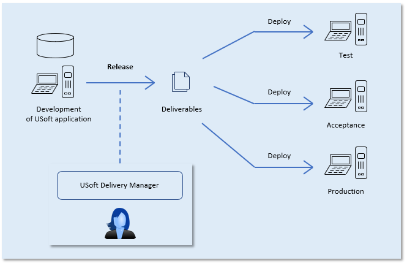
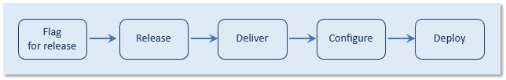
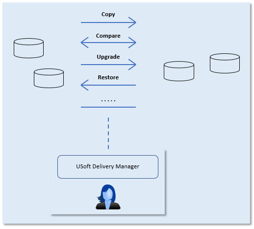

# Introducing USoft Delivery Manager

When you develop rules-based applications in the USoft platform, you don't just use a single computer. The need naturally arises to have different environments for different purposes: development, test, acceptance, production, laboratory, demo, training, separate locations for modular development...

With this need comes also the need for easy transfer of deliverables and application data between machines for these various purposes. Delivery Manager is the component of the USoft platform that helps you automate these actions.

USoft Delivery Manager is able to act as a *release manager* and as a *repository manager.* It is not a backup-and-recovery tool for administrators.

A release manager is a tool that specifically helps you deliver software artefacts from a Development environment to a target machine, for example, to a Production machine.

A repository manager is a tool that facilitates data handling between multiple repositories: clear, copy, move, import, export, compare...

## Why USoft Delivery Manager?

USoft Delivery Manager's functions have some overlap with those of a version management tool as used by developers of object-oriented code, such as .git. One difference is that USoft Delivery Manager is expert in handling sets of structured data stored in an RDBMS. This is important because, unlike applications in many other coding environments, the larger part of every USoft application is located in database records and not on the file system. Another difference is that USoft Delivery Manager automates many of the USoft-specific routines that you carry out regularly when working with the USoft tool set, for example, (in Definer:) generate-flat-files, create-tables, synchronise-module, (in Authorizer:) fill-authorizer-tables, (in Web Designer:) publish-application, (in Service Definer:) publish-server.

## Understanding Delivery Manager’s style

You may be surprised by Delivery Manager’s lack of features in the areas of: debugging, error reporting and error handling, logging, scheduling, and user concurrency.

Delivery Manager is not a fully-fledged development environment and it is not part of USoft core tooling. It is add-on tooling that aims to facilitate working with the core USoft tools. It adds to the standard USoft tooling in a number of specific ways.

### Automatic calls to USoft features

Delivery Manager adds the ability to *automate calls* to standard USoft features offered by the core USoft tools, such as Create Tables in Definer, Generate Flat File in Definer or Windows Designer, Publish Server in Service Definer… It does this by making it easy, from a Delivery Manager instance, to log on to any local or remoter USoft instance and to execute the standard feature there. What you gain is that you can now automate the execution of the feature by pressing a single button, as opposed to having to log on to different repositories, open USoft applications there, and do manual action such as pressing buttons, finding menu options or fillout out dialog fields. As a knock-on benefit, you can now also define such calls as being steps in a predefined sequence of automated actions that you find yourself repeating often. Delivery Manager calls these steps Task Steps. The preset sequence of task steps is called a Task.

Delivery Manager makes it easier to *call* features. But it does not actually change any other aspects of the functionality:

- It does not change error handling. Any errors you get are the errors that the feature already returned when called manually.
- It does not change logging behaviour. Any logging you get is the logging behaviour that the feature already had when called manually.
- The functionality is still in the foreground. When you run a Delivery Manager task, it takes over your computer and you see Windows screens popping up as if you called the feature yourself by mouse-clicking. If the feature produces interactive errors, these errors still appear interactively - they are not automatically written to logfile instead.

### A library of practical routines

Delivery Manager advertises an alphabetic list of all the things (Actions) that it can execute for you. In the tool, this list appears on the Actions catalog tab on the left-hand side if you have the Catalog displayed. When defining Tasks, press F12 in Task Steps and you can pick the Action that you want your Task Step to execute.

In addition to the standard USoft routines discussed in the previous section, you will also find simple additional actions, especially in the area of local Windows file management (eg., Copy File, Drop Folder...). The reason for this is that being able to combine such simple actions with standard USoft routines gives you the power to automate even complex sequences of actions that you would otherwise have to repeat frequently by hand.

Finally, Delivery Manager adds some features not found elsewhere in standard USoft tools, especially the ability to Compare data in 2 XML files based on a primary key schema.

### A methodology for delivering mixed-source application versions

USoft applications are data-intensive and rules-intensive and they often integrate 3rd-party software. Deliverables tend to be a mixture of flat files, compiled binaries, metadata, actual data, and even instructions to upgrade Production data as part of a version release.

Delivery Manager suggests a strategy for delivering such applications in a controlled and easily repeated manner. Specifically, it contains signposting to *releasing* the deliverable to a central release folder or *hatch*, and the ability to include attachments or *deploy scripts* that are self-contained executable instructions to deploy (install and run) the deliverables on a target machine.

All these strategies are optional: the entire framework, including all the technical formats, are optional. You can use Delivery Manager simply for data management without ever delivering software with it. You  can use Delivery Manager for releasing deliverables without ever using it to facilitate actual deployment of these deliverables. If you use scripting, you can choose Delivery Manager’s built-in Blend scripting framework, a technology written in XML and based on XSLT, or you can discard this and choose MS Powershell or others as a scripting language instead. Delivery Manager will still store and deliver your Powershell scripts in a structured way if you like.

The end of this article discusses combining Delivery Manager and source version control tooling such as .Git.

## USoft Delivery Manager as a release manager

With USoft Delivery Manager, you can automate many of the steps necessary to deliver a USoft application from Development to target environments such as Test, Acceptance and Production. Delivery Manager allows you to manage this delivery process adequately.

In this role, Delivery Manager makes it easy for you to:

- register all the versions of all the deliverables.
- distribute software to multiple target machines in a controlled and repeatable fashion.

- make traceable how and when software was delivered.
- compare versions of delivered software.

**USoft Delivery Manager in its role of release manager**

Looking in a little more detail, release management operations happen in 5 distinct phases:

Each is the subject of different articles in this section of the Knowledge Base.

## USoft Delivery Manager as a repository manager

You can use USoft Delivery Manager in its role of *repository manager* for a variety of data management operations, such as:

- comparisons between the main Development environment and temporary or permanent special-purpose copies of Development,
- initialisation of test data,
- automation of data management tasks such as authorisation and synchronisation,
- duplication of Production data for testing in an Acceptance environment.

This data management capacity applies to the management of *application data*, but also *metadata* and *authorisation data*.

**USoft Delivery Manager in its role of repository manager**

## USoft Delivery Manager and .Git

The purpose and functionality of Delivery Manager has overlaps with those of generic version management tools for software development, such as .Git. This is especially true in the area of automatic comparisons between different versions of the same deliverables. But there are also important differences. In particular,

- Generic version management tools concentrate on file-based code deliverables, but most USoft application deliverables are in database records.

- Delivery Manager is equipped to automate USoft standard development operations such as generating "flat files” and a "create-tables" SQL script from a USoft Definer repository.

For controlled development and delivery, it is possible to *combine* Delivery Manager and a version management tool such as .Git. To make this a success, you need to make a number of architecture decisions.

When you combine with .Git, a logical architecture could be to define as Root Folder in Delivery Manager a *local* filepath such as 'c:\\USoft\\*application*'. In such a setup, each developer would call Delivery Manager's Release actions to write deliverables to a private location. Uploading the results to a shared development tree is a separate next step, in which they are pushes to a remote .Git tree. (You must accept, in this setup, that all development machines use the same local filepath.)

This contrasts with settings where Delivery Manager is used without a version management tool. In such settings, a logical way of working is to set the Root Folder to a filepath that leads to a *shared* location on the file system.

In a Delivery Manager context, an advantage of a version management tool like .Git is that it makes fine-grained differences between deliverables traceable and performs version control on these differences. Examples include differences in lines of code in .js and .css files in a USoft web publication; differences in .NET RDMI component code; and differences in lines of Java code in a server defined in USoft Service Definer.

Because Delivery Manager is itself specialised in releasing repository content, a .Git server combined with Delivery Manager does not typically have the distribution of new code to other developers as a primary goal. However, there are exceptions, for example the contents of an Alternative Template Folder (as used by USoft Web Designer), which contains file-based sources that are ideally placed under a .Git server from where an individual developer could pull them to his or her local development environment prior to a USoft Web Designer session.