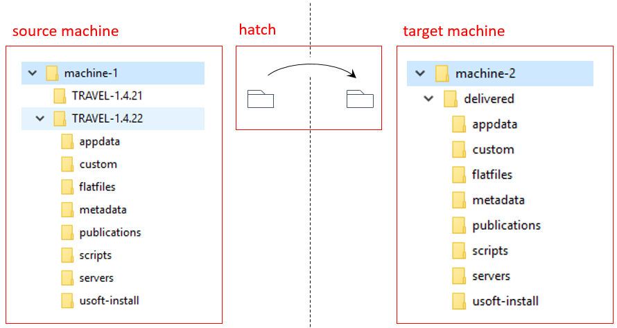

# Release management: Deliver phase

*Deliver* is the operation of physically bringing new software to a target machine. USoft Delivery Manager encourages you to deliver by applying the *hatch* principle.

### Hatch principle

With USoft Delivery Manager, you first release all deliverables to a single *release folder*. Then, you copy that folder to a specified location on each target machine: the *delivery folder*. Release folder and delivery folder are a hatch. First you bring everything together. Then you pass it through the hatch. On the other side of the hatch, you unpack the delivery, configure and distribute all its elements, and do whatever else is necessary for successful deployment on the target machine.

The picture below suggests a situation where you use a File Explorer application to view file structures on different machines. This is possible if these machines are in the same network and you have set up some system of shared drives with appropriate access rights.

Many other setups are possible, such as delivery via the Internet or via an FTP server.

Whichever technical solution you choose, the hatch principle remains the same.

### Best-practice tips

Consider keeping versioned folders only on the **source** side. On the target side, keep a single folder called "delivered".

On target machines, you do not need to keep version information in folder names, because you can have Delivery Manager include a packing slipin each delivery which automatically contains version information.

Do not keep multiple versions on target machines. Each time you deliver, **overwrite** the "delivered" folder on the target machine.

Do not allow any transfer of information other than through the hatch. For example, if you require a new installation of the USoft product on a target machine, make sure the patch name of the version to be installed is found as an instruction in the deliverable in the hatch. You may even decide to place the actual USoft executable in the hatch.

The folder names chosen in the picture in this article reflect some of these best-practice tips.