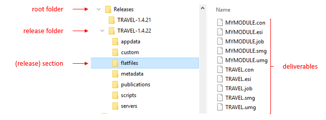

# Release trees

A *release tree* is a folder on a file system that contains releases produced by an instance of Delivery Manager. This is the *only* place where this Delivery Manager writes to: it is a *hatch* that is the only point through which deliverables are passed to target machines.

The folder that is the location of the release tree is the *root folder*. In Delivery Manager, find the foot folder by selecting Release, Current Release from the menu.

The root folder contains one or more *release folders* which, in turn, contain *deliverables*.

### Initialising the release tree

You can use Delivery Manager for releases, but also for other things. Only in the first case do you need a release tree.

If you plan to use Delivery Manager for releases, [initialise](/docs/Continuous_delivery/Delivery_Manager_basic_procedures/Initialising_a_release_tree.md) the release tree as the first logical step when you start using the tool.

:::note

Once it is initialised, you can [move](/docs/Continuous_delivery/Delivery_Manager_basic_procedures/Dropping_moving_archiving_a_release_tree_or_starting_over.md), [archive](/docs/Continuous_delivery/Delivery_Manager_basic_procedures/Dropping_moving_archiving_a_release_tree_or_starting_over.md), [drop](/docs/Continuous_delivery/Delivery_Manager_basic_procedures/Dropping_moving_archiving_a_release_tree_or_starting_over.md) the release tree, or [start over](/docs/Continuous_delivery/Delivery_Manager_basic_procedures/Dropping_moving_archiving_a_release_tree_or_starting_over.md) with Delivery Manager.

:::

Assuming that you use Delivery Manager to release deliverables to target machines, initialising a release tree is a logical first step when you start using Delivery Manager for your USoft application.

A Delivery Manager instance can manage only 1 release tree at any one time.

### Structure of the release tree

The release tree or root folder contains a collection of 1 or more subfolders called *release folders.* Each release folder has the name of a version of the top-level application that is released in the release tree. Each release folder has subfolders, each of which corresponds to a section: it is dedicated to a specific type of deliverable. A section folder may itself have subfolders. The number of different sections in a release folder depends on how many different types of deliverable you have, and how many of those you have already released at least once for the version.

In the picture in this help topic, the first release for which the release tree was used was 'TRAVEL-1.4.21'. The 'TRAVEL-1.4.21' release folder contains all the deliverables for this version. You can use any naming scheme for release folders (= versions). For example, this folder could equally have been called '1.4.21'.

Currently, the team is working on a new version called 'TRAVEL-1.4.22'. The picture shows that in the section called 'flatfiles', 10 flatfiles have so far been released, 5 for the top-level TRAVEL application, and 5 for an internal module consumed by TRAVEL that is called MYMODULE.

In Delivery Manager, you can view at all times what is the *current release folder,* ie., the folder where current delivery takes place. Do this by selecting Release, Current Release. In the example, the current release folder is 'TRAVEL-1.4.22'.

As long as the current release folder remains the same, every time you release new deliverables (for example, new flat files) this action will overwrite any previous deliverables of that type.

### Creating a new release

You can [create a new release](/docs/Continuous_delivery/Delivery_Manager_basic_procedures/Creating_a_new_release.md). This causes a new release version number to become the *current release.* For example, in the picture in this help topic, the current release is 'TRAVEL-1.4.22'. You can create a new release named 'TRAVEL-1.4.23'. As a result, 'TRAVEL-1.4.22' becomes the *previous release.*

Creating a new release has the effect of *freezing* the current release. From the time when you create 'TRAVEL-1.4.23', Delivery Manager will no longer write to the 'TRAVEL-1.4.22' folder: no more changes will be made to 'TRAVEL-1.4.22'. This makes version 'TRAVEL-1.4.22' suitable for distribution to target machines.

This way of working ensures that all target machines have identical deliverables of a given version, even if they don't all pick up that version at the same time.

In a given release tree, Delivery Manager only supports a lineair structure: a single sequence of releases with no side branches. Each release except the initial release has exactly 1 previous version. Each release except the current release has exactly 1 next version.

When you create releases, Delivery Manager does not clean up or archive older releases. Administrators must perform any desired clean-up, archive, and backup procedures by working at file system outside the Delivery Manager application. Delivery Manager does keep a Release Frame record for each past release folder, but for past releases it does not guarantee that a corresponding folder in the file system remains in existence. You can delete Release Frame records for older releases if you like. However, comparison features will work properly only if you keep the *previous* release folder of the current release intact.

### Reverting to the previous release

You can [revert to the previous release](/docs/Continuous_delivery/Delivery_Manager_basic_procedures/Reverting_to_the_previous_release.md). The current release is dropped and the previous release becomes current.

Reverting to a previous release is not normally part of a typical release process. The only intended use of the Revert option is to go back to the previous release if you have made some mistake. For example, you can revert if you have just started a new release but you have changed your mind about the ideal name of this new release.

When you revert, Delivery Manager removes everything associated with the current release and then automatically qualifies the previous release as "current". You could go all the way back to the initial release by repeating the Revert action, but there is a [better way](/docs/Continuous_delivery/Delivery_Manager_basic_procedures/Dropping_moving_archiving_a_release_tree_or_starting_over.md) to start over with Delivery Manager, if that is what you want.