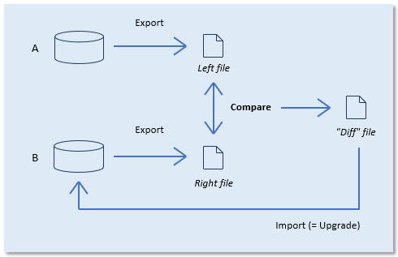

# Repository management: Compare

*Compare* is the operation of detecting and reporting differences between similar (but probably different) versions of the same data set: *comparisons* of data sets from 2 repositories.

Comparison is performed by application. For example, Delivery Manager supports the comparison of metadata sets (application = USD), application data sets (application = \<your application name>), and authorisation data sets (application = USAUTH).

Comparison requires 2 input XML files, the *left file* and *right file*, which may be obtained by executing export actions. Comparison outputs a third XML file, which describes the result of the comparison, the *"diff" file.* This "diff" file is an executable: the instructions it contains may be executed by importing the "diff" file into a repository where the differences have not yet been applied.

Using comparison, you can bring (*upgrade*) a repository B to the same state as another repository A. Export the contents of A as the left file. Export the contents of B as the right file. Execute the comparison. Import the resulting "diff" file into B:



While performing the comparison, Delivery Manager needs to log on to B to retrieve primary key information that serves as the basis for comparison.

To execute the comparison, call the Compare data files action.

### Input data format

The expected input data format for the comparison (the data format of the left file and right file) is the standard USoft XML format used also by most of the USoft 9.1 export and import routines. For more information, go to [USoft XML formats](/docs/Repositories/USoft_XML_formats/USoft_XML_formats.md). Here is an example snippet of this data format:

```
  <Accredited_Persons>
    <PERSON ID="177" FAMILY_NAME="Haynes" FIRST_NAME="Deborah"/>
    <PERSON ID="112" FAMILY_NAME="Smith" FIRST_NAME="John"/>
  ...

```

### Output ("diff") data format

The output data format (the data format of the "diff" file) is in the standard USoft XML format and contains DML instruction tags.

DML instruction tags are **\<Insert/>, \<Update/>, \<Delete>** child elements that indicate data manipulations required to bring a repository A, from which the right file was drawn, to the same state as a repository B from which the left file was drawn.

A "diff" file produced by USoft Delivery Manager is a mix of the standard USoft XML format and the format with-processing-instructions, because:

- A newly introduced record (INSERT) is not marked by an \<Insert> element. Rather, it simply appears in the "diff" file as flat data. This produces the same effect on import of the "diff" file.
- A dropped record (DELETE) is marked by a \<Delete> element as specified for the XML-format-with-processing-instructions.
- An updated record (UPDATE) is marked by an \<Update> element only if the update does not affect a record's primary key. The update of MAX_AGE in the following example record appears with an \<Update> element because MAX_AGE is not in the primary key. In this format, only primary key columns and updated columns appear in the XML:

```
<TOUR DESTINATION="AUSTRALIA" TOUR_TYPE="ISLAND SUNTANNER" MAX_AGE="75">
  <Update MAX_AGE="65"/>
</TOUR>
```

By contrast, the update of DESTINATION appears as follows, because DESTINATION is in the primary key:

```
<TOUR DESTINATION="TASMANIA" TOUR_TYPE="ISLAND SUNTANNER" NUM_DAYS="12" MAX_AGE="" 
  DESCRIPTION="Exclusive sailing adventure to the Great Barrier Reef&#10;"/>
<TOUR DESTINATION="AUSTRALIA" TOUR_TYPE="ISLAND SUNTANNER" NUM_DAYS="12" MAX_AGE="" 
  DESCRIPTION="Exclusive sailing adventure to the Great Barrier Reef&#10;>
    <Delete/>
</TOUR>
```

### Comparison by application

Delivery Manager compares data by *application,* where *application* is either a USoft application (USD, USTESTER, USAUTH, USERVICE, UDELIVER) or an application that you have defined yourself. USoft applications map to USoft tool names:

|**Application name**|**Tool name**|
|--------|--------|
|UDELIVER|USoft Delivery Manager|
|USAUTH  |USoft Authorizer|
|USD     |USoft Definer|
|USERVICE|USoft Service Definer|
|USTESTER|USoft Benchmark|


### Output file names

Output files have the .diff.xml extension:

|**Application**|**Outputfile name**|
|--------|--------|
|UDELIVER|UDELIVER.diff.xml|
|USAUTH  |USAUTH.diff.xml|
|USD     |*user-application*.USD.diff.xml|
|USERVICE|USERVICE.diff.xml|
|USTESTER|USTESTER.diff.xml|
|(Other) |*user-application*.diff.xml|


### Delivery Manager actions performing Compare

To perform your own comparisons, call the Compare data files action. This action requires that you specify the left file, right file and output file explicitly.

Also, you must specify the application name and a database account (a repository). This is necessary because there must be a basis for comparing records. This basis is each record's primary key column value, or combination of primary key column values, as defined in the repository you specify.

In the context of releases, the following Delivery Manager actions perform comparisons between the current release and the previous release *automatically:*

|**Release action**|**Output "diff" file**|
|--------|--------|
|Release deliverable appdata|*release‑folder*\\appdata\\*application*.diff.xml|
|Release metadata|*release‑folder*\\metadata\\*application*.USD.diff.xml|


 

In addition, the Release script action, if called with the option "Include physical tables upgrade script = Yes", produces a create-tables script based on the comparison of current-release metadata and previous-release metadata:

|**Release action**|**Output file**|
|--------|--------|
|Release scripts|*release‑folder*\\scripts\\*application*.200.upg.rdbms.sql|


 