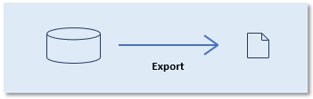

# Repository management: Export

*Export* is the operation of copying data from a repository to a file on the file system.

Delivery Manager facilitates the export of metadata, application data, authorisation data, and test data from USoft applications for a variety of purposes.



### Output format

The format in which data is exported by default is a standardised USoft XML format. In this format, XML element names map to table names, XML attribute values map to column names, and XML attribute values map to column values.

This format is used across the entire USoft platform with the exception of USoft Benchmark, which still uses the obsolete TDF format, and conventional Export Tasks in USoft Batch (now part of USoft Definer), which still output comma-separated values.

For convenience and for backward compatibility only, Delivery Manager offers "Export to TDF" as a separate action.

Delivery Manager outputs to the variety of the USoft XML format that supports multi-table data in a single output file, even if the exported data is from a single table:

```
<multi-table-root>
  <underscored-object-name-plural>
    <table column="value" column="value" ... />
...

```

For example:

```
<MultiExport>
  <Accredited_Persons>
    <PERSON ID="177" FAMILY_NAME="Haynes" FIRST_NAME="Deborah"/>
    <PERSON ID="112" FAMILY_NAME="Smith" FIRST_NAME="John"/>
  ...

```

### Output by application

Delivery Manager outputs data by *application,* where *application* is either a USoft application (USD, USTESTER, USAUTH, USERVICE, UDELIVER) or an application that you have defined yourself. USoft applications map to USoft tool names:

|**Application name**|**Tool name**|
|--------|--------|
|UDELIVER|USoft Delivery Manager|
|USAUTH  |USoft Authorizer|
|USD     |USoft Definer|
|USERVICE|USoft Service Definer|
|USTESTER|USoft Benchmark|


The application name is an indication of the purpose of the data:

|**Application**|**Type**|**Purpose**|
|--------|--------|--------|
|UDELIVER|USoft application|Delivery procedures|
|USAUTH  |USoft application|Authorisation data|
|USD     |USoft application|Metadata|
|USERVICE|USoft application|REST/SOAP service definitions|
|USTESTER|USoft application|Test data|
|(Other) |User application|Deliverable application data ('technical tables')|


### Output file names

When you export to the obsolete TDF format, you specify the destination *file.* It is common practice to use the **.tdf** file extension.

When you export to the default XML format, you specify the destination *folder.* Delivery Manager writes to this folder, using default outputfile names:

|**Application**|**Outputfile name**|
|--------|--------|
|UDELIVER|UDELIVER.xml|
|USAUTH  |USAUTH.xml|
|USD     |*user-application*.USD.xml|
|USERVICE|USERVICE.xml|
|USTESTER|USTESTER.xml|
|(Other) |*user-application*.xml|


### Re-importability

Data exported to the XML format are *re-importable.* Exactly how exported data are re-importable is determined by settings of the **usoft-xml** processing instruction, which looks like this:

```
<?usoft-xml version="1.0" action="multi-tables-import" use-io-formats="no" verify-original-values="no" return-corrected-records ="yes"?>
```

Export files may be re-imported:

- By calling a Delivery Manager****[Import appdata](/docs/Continuous_delivery/Delivery_Manager_actions_by_name/Import_appdata.md) or [Import metadata](/docs/Continuous_delivery/Delivery_Manager_actions_by_name/Import_metadata.md) action and passing the export file as a parameter.
- By calling [XML.Import](/docs/Extensions/XML_internal_component/XMLImport.md).

### Overview of Delivery Manager export actions

Delivery Manager offers the following standard procedures for exporting data, or *export actions*:

|**Delivery Manager export actions**|**Export format**|
|--------|--------|
|Export all appdata|XML     |
|Export deliverable appdata|XML     |
|Export metadata|XML     |
|Export to TDF|TDF     |


For general purposes of repository management, call the Export all appdata action, except for exporting USoft Definer data (application = USD), for which you call the Export metadata action.

Delivery Manager allows you to indicate the subset of data in an application that are "technical data". "Technical data" are to be (re)delivered from Development as opposed to being determined or manipulated by end users in Production. To export only this subset, call the Export deliverable appdata action as an alternative to the Export all appdata action.

### Export actions and release management

USoft Delivery Manager also performs export actions in a release management context. It offers special release actions that are based on an export action. The release action exports data automatically to a subfolder of the current release folder:

|**Release action**|**Based on export action**|**Output file**|
|--------|--------|--------|
|Release deliverable appdata|Export deliverable appdata|*release‑folder*\\appdata\\*application*.xml|
|Release metadata|Export metadata|*release‑folder*\\metadata\\*application*.USD.xml|


These actions have the special feature of producing, by default, not just a standard export file, but also a "diff" file. A "diff" file contains differences between the exported data and the version of the same data that was exported in the previous release:

|**Release action**|**Output "diff" file**|
|--------|--------|
|Release deliverable appdata|*release‑folder*\\appdata\\*application*.diff.xml|
|Release metadata|*release‑folder*\\metadata\\*application*.USD.diff.xml|