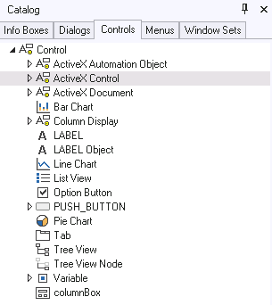

# ActiveX objects in the Windows Designer catalog

The Controls tab page of the Windows Designer catalog includes the following classes:

Under Generic Control:

- ActiveX Control

All controls in the registry

- ActiveX Automation Object

All automation objects in registry

Under Column Display, OLE Container:

- ActiveX Document Column

All embeddable objects in the registry (for example Word documents, Excel worksheets)

- ActiveX Control Column

All objects in the registry, used in cooperation with the column control. Using this class, you can create a column control that has the look and feel of an ActiveX control while interacting with each record's column value (for example, a Calendar Control)

- ActiveX Automation Column

This object has no predefined subclasses. You can insert any subclass of ActiveX Automation Object into it. These controls have the look and feel of an imported ActiveX control while interacting with a column value stored for each record

:::note

In most cases, the vendor-supplied icon or bitmap for the ActiveX object will be used in the catalog.

:::
