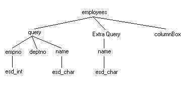
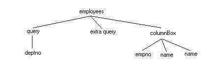

# ESI object model compared to other models

The ESI object model is different from the models used in the Windows Designer, such as the internal (widget) model, and the layout model. Also, the context identifiers used in the object model are not "paths". Asterisks (*) denote classes, and dots (.) denote components.

These different models are compared below.

In this figure, "empno", "deptno", "name", and "name" contain data, while "esd_int", "esd_char" specify the look. "deptno" is non-displayed, so does contain data but does not have a look.

**Internal (Widget) Model**

The internal (widget) model, as displayed by the Object Activator in the Windows Designer, displays all generated objects from a parent-child point of view. This model is of NOimportance when using the ESI action interface. It does, however, play an important role when writing action statements.

In this figure, the items under query and extra query (i.e. "empno", "deptno", "name" and "name") contain the data, whereas the items directly under employees (i.e. "empno", 'name" and "name") specify the look.

**Layout Model**

The layout model, as displayed by the Object tree in the Windows Designer, describes which objects are contained within (managed by) which other objects. This is a developer-centered view on the internal object hierarchy which hides objects that are irrelevant from an application development perspective.

In the layout model, "empno", "name" and "name" are the objects "esd_int", "esd_char" and "esd_char" (look).