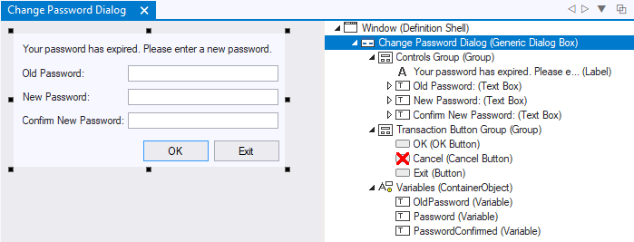

# Dialogs

A **dialog** is a window that helps an end user perform a specific task, or communicates with the user about some specific issue that has arisen.

Dialogs contrast with info boxes, which enable an end user to interact with data in database tables.

Dialogs are usually comparatively simple and small. They usually contain one or more buttons that enable a user to respond.

Dialogs are usually **modal**: the user can only leave the dialog by responding to it. Other windows cannot be made active as long as the dialog is active.

A dialog is opened when a user chooses a menu option or clicks a button, or when some event occurs that requires communication with the user. Dialogs do not appear in the default application that USoft generates on the basis of the data model defined in USoft Definer: as a developer, you must script their appearance, by using for example the action statement:

```
dialog-class.Window.Create()
```



Design view (left) and object tree (right) of a dialog class### Designing a dialog

To design a dialog class:

1.In the Windows Designer catalog, click on the Dialog tab page.

2.In the tree view, identify a default dialog class that looks like the dialog you have in mind. Right-click on it and choose New from the context menu.

A new dialog subclass appears as a child node.

3.Right-click on the new dialog subclass, choose Rename from the context menu, and type an appropriate name for your new dialog subclass.

4.Open the new dialog subclass.

5.Make any required changes to objects and properties in the dialog, for example:

- Open the Property Inspector to change property values of objects.
- Open the Controls tab page in the catalog , and insert new objects into the dialog by dragging-and-dropping them onto the design view of the dialog class.

6.Save your changes.

### Calling a dialog

To call a dialog class you have designed:

1.Select the triggering object from where you want to call the dialog.

For example, if the dialog must open when the user presses a button, open the class that contains the button and select the button object. If the dialog must open when the user chooses a menu option, open the menu class and select the menu line object.

2.Open the Property Inspector for the object, and select the event property that corresponds to the event you want to associate with the dialog.

For example, if the dialog must open when the user presses a button, select the button's Action property. If the dialog must open when the user chooses a menu option, select the menu line's Script property.

3.Set the property to the action statement:

```
dialog-class.Window.Create( parameter, parameter ... )
```

where *parameters* are required only if you need to pass values to the dialog.

### Conditional behaviour on dialog exit

On dialog exit, conditional behaviour is often required depending on what has happened in the dialog.

The simplest form is that some action A must performed if the user exits the dialog by pressing button A, while some other action B must be performed if the user exits by pressing button B. This can be handled simply by placing different action scripts on the Action property of each button.

More complex handling involves interpreting user input. Implement this in a decision. Script an

```
ActionDecision( ... )
```

call on the exit button, passing the value input by the user in the dialog as an input parameter between the parentheses. The decision will give you full functionality for interpreting the user input.

### Passing values to and from dialogs

Some dialogs require that you pass values to them. In other cases you must collect values produced in dialogs. If you have a chain of dialogs in which you collect answers to multiple questions, the values must be passed along the chain.

- A simple technique is to store values in user-defined global variables.

- You can also pass values to other windows by setting up different forms of window interaction. These techniques may involve the use of user-defined properties and the Self() keyword.

 