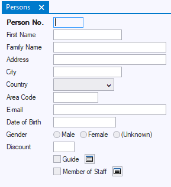

# Info Box classes

The data forms in the windows of a USoft Windows application are made up of **info box classes.**

Info boxes are GUI classes based on the data model you define in USoft Definer. They allow end users to interact with data.

When you open Windows Designer, a complete system of *default classes* is ready for you as a starting point for your Windows application. Default classes are derived from your data model. For example:

- For each table in your data model, there is a default GUI class that you can use to let your end users interact with that table.

- For each time a table is child in a Relationship, there is a default GUI class (called *related info box)* that you can use to let your end users navigate easily from parent data in this Relationship to related child data.

## Do not paint default classes

Best practice when developing info boxes is to **start by creating your own subclass**. Why? Because this way, the default class remains unspoilt, and you can draw new subclasses from it later.

A possible exception is a situation where you know you are only doing a quick prototype that you will throw away after use. In this case, it is attractive to work with the default classes.

To create your own subclasses in the catalog:

1. Right-mouse click in the catalog on the class that you want to create a subclass from.

2. Choose New from the context menu. A subtype node appears in the catalog.

3. Right-mouse click on the new subtype.

4. Choose Rename from the context menu. Give a meaningful name to your new subtype, for example, "MyInfoBox".

5. In the end user menu, add a menu item with a script such as

```
WindowCreate( MyInfoBox )

```

For example, an info box called Persons could look like this:



### Designing an info box

To design an info box class:

1. In the Windows Designer catalog, click on the Info Boxes tab page.

2. In the tree view, identify a default class that looks like the info box you have in mind. Right-click on it and choose New from the context menu.

A new info box subclass appears as a child node.

3. Right-click on the new subclass, choose Rename from the context menu, and type an appropriate name for your new subclass.

4. Open the new subclass.

5. Make any required changes to objects and properties in the info box class, for example:

- Open the Property Inspector to change property values of objects.
- Open the Controls tab page in the catalog , and insert new objects into the info box class by dragging-and-dropping them onto the design view of the dialog class.

6. Save your changes.

### Calling an info box

To call an info box you have designed:

1. Select the triggering object from where you want to call the dialog.

For example, If the info box must open when the user chooses a menu option, open the menu class and select the menu line object.

2. Open the Property Inspector for the object, and select the event property that corresponds to the event you want to associate with the info box.

For example, if the info box must open when the user chooses a menu option, select the menu line's Script property.

3. Set the property to the action statement:

```
info-box-class.Window.Create( )

```

 

##  

 

##  

 

 