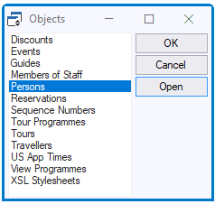

# Info windows

USoft generates an **info window** for each table that you define in USoft Definer. An info window is simply a Windows form that allows users to query and manipulate data in the table:

USoft also generates an **object list** that users can open via View, Objects in the menu, and that gives access to each generated info window. The names or prompts in the list are the Object Name Plural names that you supplied in USoft Definer:

 