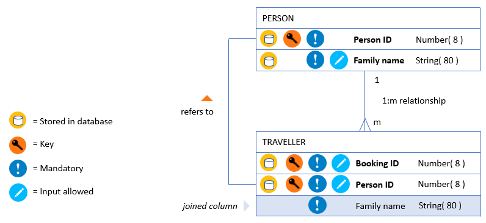
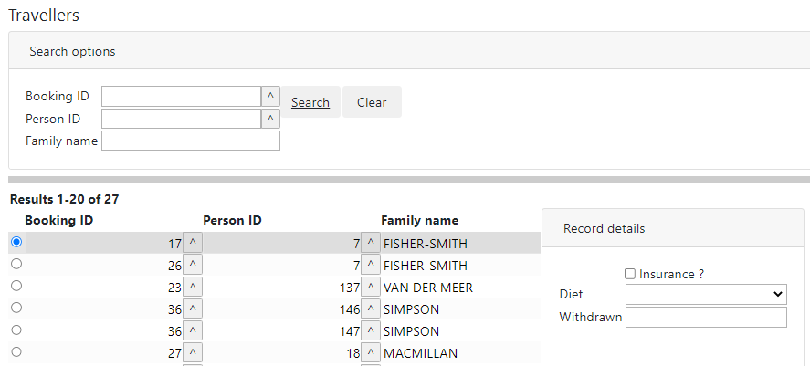
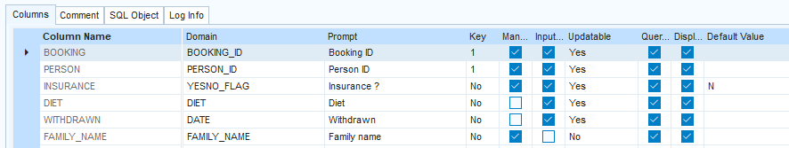
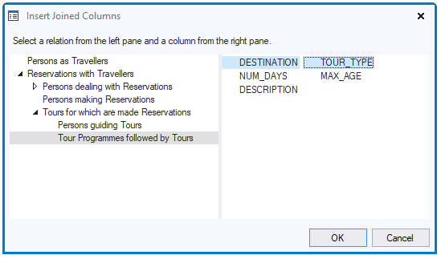

# Joined Columns

## What is a joined column?

A **joined column** is a column that you present *as if* it were a column in a table, but that in fact takes its value from a different table, or from a computation or calculation of values in different tables.

The most classic example of a joined column is the TRAVELLER.FAMILY_NAME example in this picture:



This classic joined column is in a child table (here, TRAVELLER). Its value is not actually stored in the child table, but taken from the parent table (here, PERSON).

This example shows one important reason for joined columns. Without the joined column, humans inspecting the TRAVELLER table will have difficulty identifying persons on the basis of the meaningless Person ID code number. The Family Name value assists them in identifying the persons "behind” the codes.

This is only the most straightforward example of a joined column. There are more complex cases where the joined column values are determined by applying a calculation or computation (for example, string concatenation) to data in related tables. These you could consider as a further, only slightly different type of joined column.

## Joined columns in USoft Web Designer

Here is a USoft near-default web page that has the TRAVELLER.FAMILY_NAME joined column:



 

The steps that have been taken to get the joined column into this web page are detailed in the [Pattern 7: Classic joined column](/docs/Web%20and%20app%20UIs/Page%20and%20data%20source%20constructs/Pattern%207%20Classic%20joined%20column.md) article. In general terms, these steps are:

- In the TRAVELLER DataSource, embed a Lookup DataSource PERSON AS TRAVELLER based on the PERSON-TRAVELLER relationship from USoft Definer.
- In the web page, add column displays that make use of the FAMILY_NAME data looked up by this embedded data source. In the picture, this has been done in the result grid, but also in the Search box at the top.

## Joined columns in Logical Views

Logical Views are a primary means of realising joined columns. SQL is expressive enough to let you define both "classic” joined columns and complex joined columns involving computations or calculations. Here is the TRAVELLER.FAMILY_NAME joined column implemented as a Logical View column:

```sql
SELECT      t.*
,           p.family_name
FROM        traveller t
,           person p
RELATE      p "AS" t
```

When you have this Logical View checked, you will see that USoft generates settings Updatable = No and Input Allowed = No for the joined column:



> [!TIP]
> In service-oriented UIs such as REST APIs, it can be very useful to present many types of data *as if* they all came from the same table. This is where Logical Views come into their own.
> In this context, it is also frequently possible and desirable to have users manipulate data *as if* they were all stored in the same table. Use [rule-based Logical Views](/docs/Modeller%20and%20Rules%20Engine/Logical%20Views/Rulebased%20logical%20views.md) to let users submit data *as if* these were all stored in the same surface table structure, while you actually channel these data to different columns in related database tables in the background.

## Joined columns in USoft Definer: Virtual columns

> [!WARNING]
> The feature discussed in this section has now lost most of its relevance, but can still be useful if you quickly want to create "classic” joined columns in a USoft C/S UI, for example, for prototyping or for demos in meetings.

In USoft Definer, in the Database Table window, for a child table, you can define columns with Type = Virtual. This allows you to create a "classic” joined column taking its value from the parent table and displaying it in all boxes for the child table as if it were a column in the child table itself.

To define a virtual column:

1. In the child table, define a new column, specifying Virtual (not: Database) in the Type field.

2. With this new virtual column as the current record, click the Related List button on the toolbar (or type F9), and choose Column that Gives a Value to This Joined Column.

The Column that Gives a Value to This Joined Column related window appears.

3. Complete the window as follows:

- Click the Child Table lookup button to select the combination of Parent Object, Parent Role and Child Object that is needed to 'join' the joined column with the parent column.
- Click the Parent Column lookup button to select the column that will give its value to the joined column.

4. Save work .

## Joined columns in USoft Windows Designer

> [!WARNING]
> The feature discussed in this section has now lost most of its relevance, but can still be useful if you want to create "classic” joined columns in a USoft C/S UI. The chief difference with the "virtual columns” from the previous section is that you can be more specific about the windows where you want the joined columns to appear.

To create joined columns in Windows Designer:

1. Use the Windows Designer catalog to open the appropriate window class for the child table.

2. In the design view, select the Info Box into which you want to insert the joined column(s).

3. From the menu bar, choose Insert, Joined Columns... This option is available only if your info box is for a *child* table.

The Insert Joined Columns dialog appears. On the left, this dialog represents the relationships that the child table is in. If there are grandparents or other ancestors, you can expand the tree view until you reach the highest-level parent:



4. In the left-hand pane, select the relationship level from where you want to take values for your Joined Column(s).

5. In the right-hand pane, select the column or columns that you want to add to your info box as Joined Column(s). Press OK. Save work.

The result is visible in the design tree (on the right of your screen) as an Extra Query object with a name such as "VIRTUAL_TYPE 1". To view the functionality, open the object in the Property Inspector. Inspect the values that USoft has generated for the Joined Columns, Relationships and Underlying Query properties.

Using the Yes Action and No Action properties, you can define additional action that must be taken if a value for the Joined Column is, or is not found. For this technique, see the article on [Extra Queries](/docs/Desktop%20UIs/Exploring%20USoft%20Windows%20Designer/Extra%20Queries.md).

 