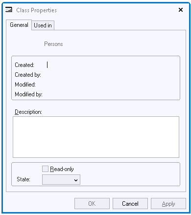

# Property Sheets

Property sheets show general information about the Application and GUI classes.

## Where to find property sheets

- To open the property sheet for the Application, choose **File, Application Properties** from the menu.

- Other property sheets are opened by choosing the Properties option from right-mouse context menu on class nodes in the Windows Designer **catalog**.

Information on Property sheets can include:

- Name.
- Created By and Modified By information (username, timestamp).
- Read-only Y/N.
- Description.
- State

The read-only switch and the description field are editable.

The State field can be used to change the icons used in the catalog for classes in the Info Boxes, Dialogs, and Menus tab Pages. Showing the different icons correctly is a visual aid during development. For example, the icons used for Info Windows are as follows:

|**State**|**Icon**|
|--------|--------|
|Enabled |

|
|Disabled|

|
|Style   |

|
|Interface|

|

For certain objects, such as the Application object, the property sheet shows additional information.

For GUI classes, the Used In tab page shows whether the class in question is used in another class.

There is a difference between property sheets and the Property Inspector tool.