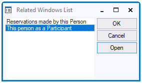
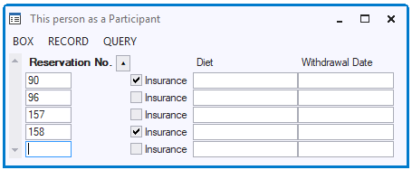

# Related windows

**Related windows** allow users to navigate, from parent data, to child tables with related data.

In the default application, the user can choose Box, Related List or press F9 to call a dialog with a list of child tables related to the info box he is currently in. The following Related Tables List appears when a user does this from a Persons info box on the basis of 2 relationships in which PERSON is parent table:

**Related Windows List**

When the user presses OK or Open, a Related Window info box is opened that corresponds to the relationship selected:

**Related Window**

The Related Window by default shows child data (if any) related to the person where the user started. Child data are shown in multi-record view; by default, 5 child records are shown. This visually enforces the idea of a 1:many relationship between Person (possibly shown in *single*-record view) and Participant (*multi-*record view in Related Window).

In the Related Window, all the child columns are shown except the foreign key referencing PERSON, since this information is already apparent from the info box where the user started. If the user clicks again in that Person info box and starts browsing through the Persons, related data will automatically scroll along in the Related Window. Any data entered or changed in the Related Window are automatically associated with the Person currently in view.

## Embedded related windows

You can embed a related window in an info window. This makes the related data more readily available since users do not need to navigate and open the related window. An embedded related window is technically not a window, but rather a related **info box.**

USoft created this kind of embedded boxes automatically when the relationship has Child Must Exist = Yes in USoft Definer.

To embed a related info box in a parent info window:

1. Open the parent window class.

2. Drag-and drop the Related Window info box class from the Info Boxes catalog onto the parent Info Window object in the object tree. This is the child object of the top-level Window object.

3. Choose Design, Run and see that parent data and child data are automatically synchronised when you, as a user, browse through retrieved parent data.

## Spreadsheet look

The default Related Windows have the traditional multi-record display style with 5 related records in view by default. You can replace this by a richer spreadsheet control:

1. In the object tree, select the Related Window object and open the Property Inspector for it.

2. In the Property Inspector, Set Column Manager Class = Spreadsheet.

The info box changes to spreadsheet look and a "gridBox" child control is visible for it in the object tree.

3. In the object tree, select the new "gridBox" object.

4. In the Property Inspector, set Alignment = Workarea.

## Multiple related windows on tabs

If you want to embed multiple related boxes in a parent window, a good design is to place each related box on a separate tab page:

1. Open the parent window class.

2. Choose Insert, Tab from the menu.

3. Select the Tab and choose Insert, Tab Page from the menu, as many times as the number of related windows you want to embed.

4. For each tab page, drag-and-drop the Related Window info box class from the Info Boxes catalog onto the tab page in the object tree.