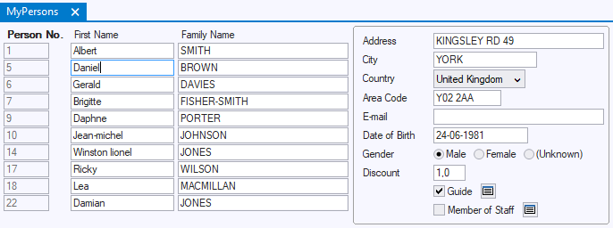

# Secondary windows

**Secondary windows** are not strictly part of the GUI that USoft generates on the basis of the data model, and they are not strictly necessary.

But they make it easier for you to achieve certain customisations, especially if you want a combination of single-record and multi-record displays of data coming from the same table.

A typical situation where an info box of type Secondary Window is applied, is when you have a record with a large number of columns that cannot all be shown conveniently in multi-record view.

You can limit the multi-record view to the columns that are most important, and show other information in a single-record secondary box.



Secondary info box (on the right)

In the example, the current record is that of Person No. 5. The single-record secondary info box on the right shows details of this person. If the user clicks in the record for No. 6, it will show details of person no. 6. The user can supply new (INSERT) or updated (UPDATE) values in both boxes. USoft will automatically associate input into both boxes with the same database record.

For each table in the data model, a default Secondary Window class is offered in the catalog, but these classes are not actually used in the default application. The window shown in the example has not been taken from the default application but has been developed by taking these steps:

1. Create a user-defined subclass of the default Persons class (of type Info Window) and call it "MyPersons".

2. Create a user-defined subclass of the default "Secondary of Persons" class (of type Secondary Window) and call it "MyPersonDetails".

3. Open the MyPersons class, change its default underlying query from:

 

```
SELECT * FROM PERSON

```

 

to:

 

```
SELECT person_id, first_name, family_name FROM PERSON

```

 

and set its No of Records Displayed property from 1 to 10.

4. Open the MyPersonDetails class and set Displayed = No for the Person No, First Name and Family Name fields it contains.

5. Go back to the MyPersons class and drag the MyPersonDetails class onto it.

6. Make adjustments to the properties of the 2 boxes (Orientation, Position, Allow Neighbour Yes/No) until they are positioned next to each other as in the example image.

 