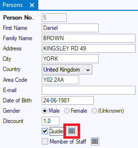
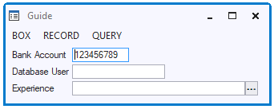

# Subtype windows

**Subtype windows** allow users to step out, from a subtype button, to a window where the user can specify values for subtype columns.

The following images show an arrangement generated in default classes on the basis of a relationship between supertype PERSON and subtype GUIDE in the data model.

Based on the relationship, a default subtype button has been generated at the Guide subtype checkbox (highlighted in red).

**Default subtype button at foreign key field**

When the user presses the button, a subtype window is opened. Even if the calling window is in tabbed mode, by default the subtype window is presented as a "floating" window. This has the advantage of leaving the calling window in view:

**Default subtype window**