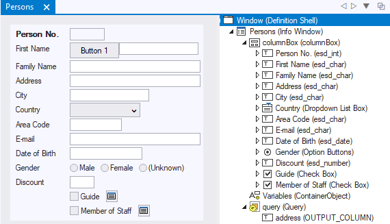
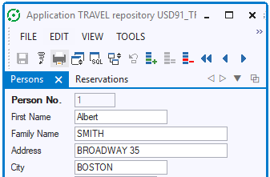
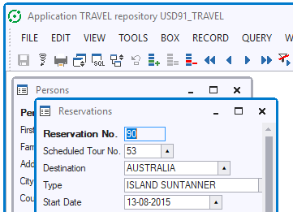

# Windows

This help topic is about **windows** as a technical object: a container of info boxes and other controls.

The user interface of your USoft Windows application is a multiple-document interface:

- An end user starts a single top-level *application window.*
- In this application window, multiple *document windows* can be opened concurrently.

Your task in Windows Designer is to develop the document windows and the way in which the user may open and close them.

In Windows Designer, a document window is either an info window or a dialog window:

- An info window contains one or more info boxes. Info boxes are used to display, edit, insert and delete data, which is the primary purpose of USoft online applications.
- A dialog does not contain info boxes. It is used for miscellaneous other purposes, such as asking the end user a question, or helping her perform a specific task.

In USoft Windows Designer, you can design window content by composing windows from info box, dialog and control classes. For each info box class and dialog class you get an initial default window which you can run as a prototype and progressively tailor to your needs.

### Window objects and properties

Info windows and dialogs are embedded in a *window object* that has its own properties. These window-level properties are managed by the window manager and determine whether the window is resizable, whether it is modal (= its user is forced to respond to it before being able to make another window active), whether the window is always displayed on top, etc.

Most window-level properties can be set from within the Windows Designer. When you have an info window or dialog open, in the Object Tree, the Window object is topmost in the hierarchy. You can access window properties by right-clicking on the Window object and choosing Properties.



### Tabbed mode and multiple windows mode

When running your application, the end user can freely toggle between *tabbed mode* and *multiple windows mode*.

Tabbed mode looks like this, with the icon in the far top right corner of the tabbed window offering the option to switch to multiple windows mode:



Multiple windows mode looks like this, with the middle icon on the far left of each window title bar offering the option to switch to tabbed mode:



### Calling your own windows

Windows that you have created as user-defined subclasses do not appear on the Object List of your default application, and neither do dialogs. To make them available to end users, you must define a menu line, a button, or another interface element that leads to the window.

To call one of your own windows:

1.Open the window class (info box or dialog) in the catalog.

2.Open the Object Activator in the appropriate context, for example, for a behavior property or as a stand-alone Object Activator for the Yes Action script of a Decision.

3.If you have an existing action statement script, place the cursor in the Script box at the point in the script where you want to open the new window.

4.Drag the window class you want to open from the catalog onto the Script box in the Object Activator.

The Object Activator creates a new action statement:

```
window-class( parameter, parameter... ).Window.Create()
```

If you have no user-defined properties for the window class you are opening, you also can use the following action statement:

```
WindowCreate( window-class )
```

5.If there are placeholders for arguments to be passed to the opening window, for each argument place the cursor on the corresponding subnode in the Script box and provide the argument value by typing a string or referring to object and properties advertised in the Object Activator.

 

 

 

 

 