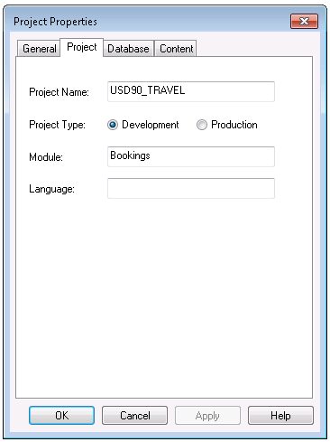
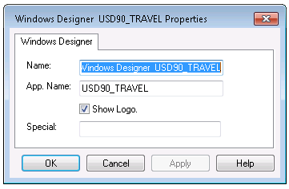
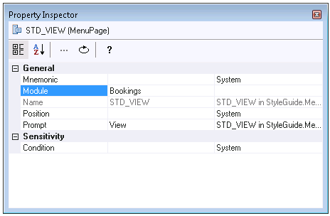

# Modular development of Windows GUIs

This section contains some important notes if you use Windows Designer on an application that consists of more than one module.

Before you can use Windows Designer, for each module you need to create a conceptual (CON) schema file. You can create the flat file from the Definer.

In a Windows Designer session, you design ONE module within ONE application at a time. The name of the module is specified in the Project Properties dialog of the Binder, in the Module field:



The name of the application is specified on the Properties sheet of the Windows Designer Binder item, in the App. Name field:



The two pictures presented here show a USD90_TRAVEL environment where you design the Bookings module within the USD90_TRAVEL application.


:::warning

With these settings, the Bookings module is read from database, and all other modules are read from flat files. Work done in the Windows Designer is work done for the Bookings module.

:::

Interface tables (that are provided by another module than you are currently working on) can be painted in Windows Designer just like other info windows.

An info window that is opened from the Object List (in the end user application) is the info window as it is designed and painted in the provider module.

## Calling windows from another module

Windows that are defined in another module than the current module can be called explicitly using this action statement:

```
Module(<module name>).WindowCreate(<name>)
```

## Modular development of application menus

If you plan to design menus within a modular application, be aware of the following:

- The main application menu needs to be designed in the MAIN module (the module with the same name as the application). It cannot be changed in other modules.
- Menus that are called from the main menu can be designed in ANY module. In this case, menu pages are inserted in the main menu. The Module property of an inserted menu pages specifies the module in which the inserted page is defined, and that it can be called from another module.



 