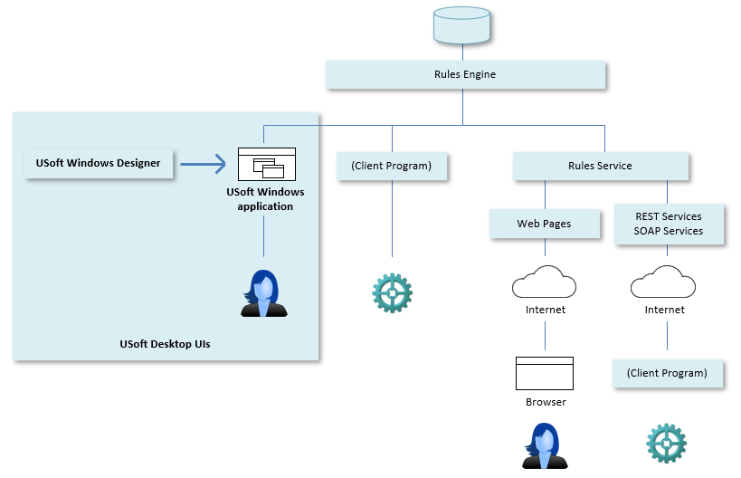

# Introducing USoft Desktop UIs

The USoft platform offers rich Windows GUI functionality. This is in spite of the fact that most commercial USoft applications today are Internet applications: they are browser-based or use a service across the Internet, or both.

Even if your aim is to deploy USoft in a web-based environment, USoft Desktop UIs could be very important to you:

- USoft Windows GUIs automatically run against the Rules Engine that you are developing in any case.
- USoft Windows GUIs are truly low-code: USoft **generates** them from the data model that you already invested in in any case, without you needing to put in extra time.
- USoft Windows Designer, a tool which is an integral part of the platform, allows you to **customise** default Windows GUIs with ease.

Why would you use Windows GUIs if you are developing a web-based solution?

- Windows GUIs require almost to effort to deploy.
- You can **test** the Rules Engine under development without worrying at the same time about browser pages or service calls.
- Windows GUIs give users an immediate sense of how your data is structured and what happens when rules are activated. This makes them ideal for **prototyping** a new aspect of the application.
- Large business applications always involve many **back-office operations** in areas such as testing-and-debugging, maintenance, release management and data management. Windows GUIs offer cheap access to these functions. They are good enough, or sometimes even better, for these tasks than web-based interfaces.

USoft Windows Designer enables rapid iterative development. Thousands of intricately interlinked rules are handled with ease, away from the concerns of web page look-and-feel or the intricacies of service-oriented APIs.

 