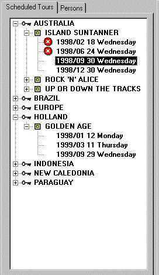

# Actions Example 10: Catalog node leading to data query

This example shows how a user can select data in a catalog tree or other tree view, and then double-click to open a window and retrieve corresponding data from the database.

Leaf nodes in the catalog tree represent scheduled tours in a travel agency. If the user double-clicks on one of these leaf nodes, a Reservations window opens in which the reservations for the corresponding scheduled tour are retrieved.



For help on creating a catalog, go to the Tree Views help topic. The catalog passes the Scheduled Tour primary key value of the selected node to the opening window:

- The window has a user-defined property to receive the primary key value as a string.
- The catalog refers to the user-defined property to pass the primary key value as a string.


:::note

The reason why you can use simple string values here is that each double-click action leads to a new info window. The info windows need not refer back to the catalog once they are created. This contrasts with examples 11 and 12, where object-like (as opposed to string-like) properties are required.

:::

## ReservationsFromCatalog Window

This scenario is part of Actions Example 10: Catalog Node Leading to Data Query.

To create a Reservation window with a user-defined property for receiving a value from a catalog, these steps were taken.

1. Create a new ReservationsFromCatalog subclass of the Reservations info window.

2. Open the ReservationsFromCatalog class, open the Property Inspector, select the Post-Open behavior property and open the Object Activator by clicking the Edit button.

3. Write this action statement script, for which you define the mySchedtourID property.

```
QueryDefine()
query.schedtour_id(mySchedtourID() )
QueryExecute()

```

Here are the steps for writing this script:

1. In the Methods pane, on the Methods tab page, select the QueryDefine() method and click Add.

2. In the Object Browser pane, select query.schedtour_id() and click Add.

3. In the Script box, select the empty parameter node for query.schedtour_id().

4. Make sure the ReservationsFromCatalog info window is selected in the Object Browser tree view (top-left).

5. In the Methods pane, on the Properties tab page, click New.

6. Define a new mySchedtourID property, accept the String default for Type, and set Argument Position to 1.

The mySchedtourID property can now be referred to by other objects as the first parameter of the ReservationsFromCatalog info box class.

7. Click OK to return to the Object Activator, and then click Set to paste the reference to the new property into your script.

8. In the Methods pane, on the Methods tab page, select the QueryExecute() method and click Add.

## Catalog double-click action

This scenario is part of Actions Example 10: Catalog Node Leading to Data Query.

To force the catalog to pass a Scheduled Tour ID to the ReservationsFromCatalog window on double-click, take these steps:

1. In the Property Inspector for the catalog, navigate to Tree View Node 3 and select the Double-click Action property on the Behavior tab page.

2. Open the Object Activator for this property by clicking the Edit/Compose button.

3. From the Windows Designer catalog, drag the ReservationsFromCatalog info box class into the Script box. This results in the following action statement being created:

```
ReservationsFromCatalog( ... ).Window.Create()
```

4. In the Script box, select the parameter subnode of this call.

5. In the Object Browser pane, select the following node:

```
Tab_1.Page_1.Tree_View_1
```

6. In the Methods list, select the GetValueFromCurrentItem method, and click the Set button. This results in:

```
Tab_1.Page_1.Tree_View_1.GetValueFromCurrentItem( ... )
```

7. In the Script box, select the empty parameter subnode of this GetValueFromCurrentItem action statement.

8. Click the Edit button, and type: schedtour_id.

9. Click OK to close the Object Activator, and save your work. This results in:

```
ReservationsFromCatalog( Tab_1.Page_1.Tree_View_1.GetValueFromCurrentItem( schedtour_id ) ).
Window.Create()

```

This action statement creates an instance of the ReservationsFromCatalog class with the schedtour_id value for the current tree view node as a parameter. This parameter is collected in the mySchedtourID user-defined property of the ReservationsFromCatalog info window that will be opened.