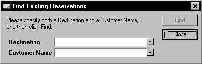

# Actions Example 11: Window with separate search dialog

This example features a dialog for permanent assistance with querying data in another window. The example shows how to define object-like properties for handling interaction between windows.

The Find Existing Reservations dialog is opened by clicking on a "Find Existing..." button in the Reservations window.



Both the info window and the dialog can remain open between queries. Each time the user clicks the Find button in the dialog, data corresponding to the search conditions are retrieved in the info window.

Each time the user clicks Find, the dialog passes the two current search conditions to the info window. The dialog has a user-defined property of type Reservations (the info window), in which it stores the info window from which it was called.

> [!NOTE]
> The reason why you must use a user-defined property returning an object, not a string, is that the dialog must be able to start queries repeatedly. Only if the dialog refers to the calling window as a real object does it have access to all the objects within that window. It is not a simple matter of passing a first-time-only string to the info window.

In other words, the dialog must "remember" what info window it is serving. It receives the internal object identifier of the runtime info window when it is opened from it.

## Find Existing Reservations Dialog

1. Create a new subclass of the Dialog Box class, rename it to "FindExistingReservations".

2. In the Controls Group, insert a text box with prompt: Destination, and set the Related Column property to:

```
TOUR.DESTINATION
```

A lookup button appears that calls a lookup window for Tours.

3. Insert a text box with prompt: Customer Name, and set the Related Column property to:

```
PERSON.FAMILY_NAME
```

4. Rename the OK and Cancel buttons to "Find" and "Close" respectively, and reposition them if required.

5. Open the Object Activator for the Action property of the Find button, remove the dialog-ok() action, and compose this action statement script:

```
myReservations.QueryDefine()
myReservations.query.destination(Variables.Text_Box_1() )
myReservations.query.family_name(Variables.Text_Box_2() )
myReservations.QueryExecute()

```

In this script, "myReservations" is a user-defined property of the dialog class. It represents a window object, not a string. Here are the steps for writing this script:

1. Make sure the FindExistingReservations dialog is selected in the Object Browser tree view (top-left).

2. In the Methods pane, click the Properties tab page, and click New.

3. In the New Property dialog, specify Name = myReservations, Type = Reservations, accept 1 as the Argument Position, and click OK.

 

Because you specified a new property with an object-like type, a new node for myReservations is added to the Object Browser pane.

 

4. Back in the Object Activator, click the myReservations object in the Object Browser, then select the QueryDefine() method, and then click Add.

5. In the Object Browser pane, select the "myReservations.query.destination" column object, and then click Add.

6. Select the empty parameter node of the newly added action statement, select the "Variables.Text_Box_1" object, and then click Set.

 

7. Follow the same steps to produce the action statement passing the customer name.

8. Finally, add the "myReservations.QueryExecute() call and click OK to exit the Object Activator.

 

## Reservations window

To get a Reservations window that the user can query via the Find Existing Reservations dialog:

1. Create a new subclass of the Reservations info box class, rename it to "ReservationsFindExisting".

2. Insert a new button and change the button prompt to "Find Existing ... ".

3. Open the Object Activator for the Action property of the button.

4. From the Windows Designer catalog, drag the "FindExistingReservations" dialog class into the Script box. This results in the following action statement being created:

```
FindExistingReservations( ... ).Window.Create()
```

5. In the Script box, select the parameter subnode of this call.

6. In the Object Browser pane, select the ReservationsFindExisting class itself (the top-level or root object in the tree).

7. Click the Set button. This results in:

```
FindExistingReservations( Self() ).Window.Create()
```

USoft replaces root-level objects by the keyword Self. The advantage of this is that the script remains legal even if the window class is renamed or embedded, or if subclass is made of it.

8. Click OK to close the Object Activator, and save your work.