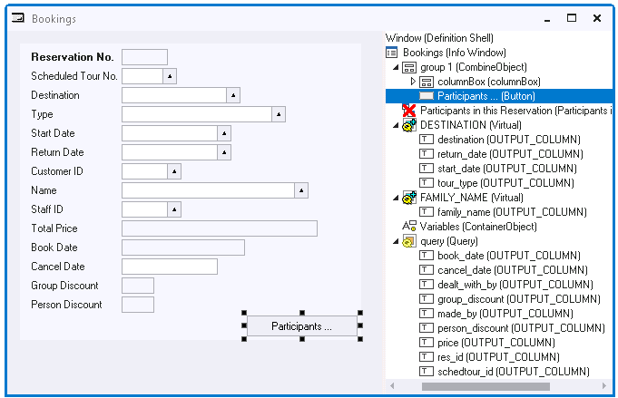

# Actions Example 2: Button opening a Related Window



If the Participants button is pressed, a related window must be opened showing Participant child data.

Set the Action property of the Participants button to:

```
Participants_taking_part_in_Reservation.Window.Create()
```

In this action statement you do not need to specify the context, because the Info Window is the default object for this action statement.