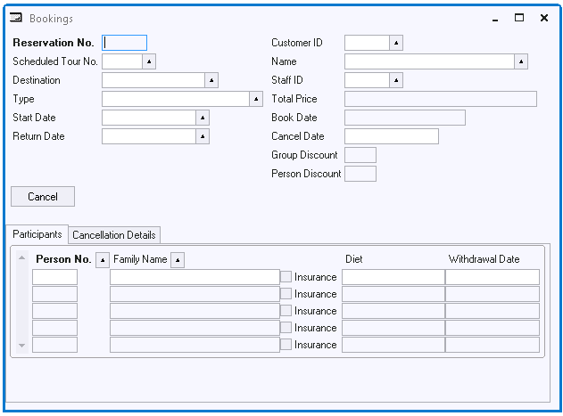

# Actions Example 3: Button leading to Tab Page sensitivity



If the Cancel button is clicked, the Cancellation Details tab page must be raised automatically to invite the user to enter cancellation details.

Using action statement syntax, set the Action property of the button to:

```
Tab_1.ControlSetActiveTab('Page 2')
```

You can type this action statement manually, or use the Object Activator to compose it.


:::danger

ControlSetActiveTab() expects simple strings, not objects, as parameters. The same is true for all other USoft native methods. Therefore you must provide the parameter in this example by manual editing. You cannot specify the tab page by selecting it from the Object Browser pane.

:::

 