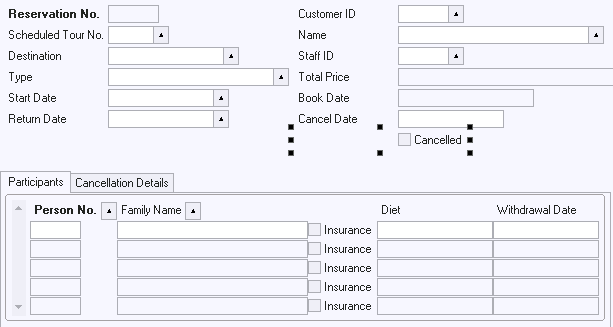

# Actions Example 4: Check Box leading to Tab Page sensitivity

This example shows an action that must only fire if a condition is met.



If the Cancelled check box is selected, the Cancellation Details tab page must be raised automatically to invite the user to enter cancellation details.

Set the On Change property of the Cancelled check box to:

```
ActionDecision('SET_CANCELLED_TAB')
```

Define the SET_CANCELLED_TAB decision as:

*Decision SQL*

```
:CANCELLED = 'Y'
```

*Yes Action*

```
Tab_1.ControlSetActiveTab('Page 2')
```

*No Action*

```
Tab_1.ControlSetActiveTab('Page 1')
```

You can type the action statements in the Yes Action and No Action manually, or use the Object Activator as a stand-alone editor to compose them. The construct :CANCELLED in the Decision SQL is an abbreviated old-style navigation path.

> [!CAUTION]
> ControlSetActiveTab() expects simple strings, not objects, as parameters. The same is true for all other USoft native methods. Therefore you must provide the parameter in this example by manual editing. You cannot specify the tab page by selecting it from the Object Browser pane.